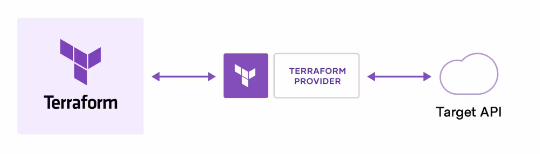
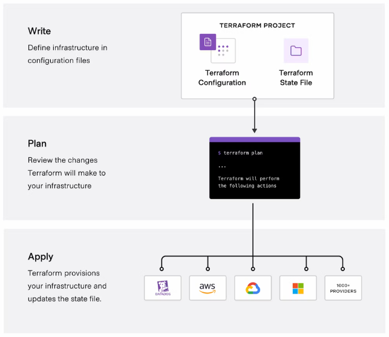

# Terraform overview

## Table of contents

* [What is Terraform](#what-is-terraform).
* [How does Terraform work](#how-does-terraform-work).
* [Key Terraform commands](#key-terraform-commands).
* [Terraform directory files](#terraform-directory-files).
* [Declarations](#declarations).
* [Creating a GCP infrastructure with Terraform](#creating-a-gcp-infrastructure-with-terraform).

## What is Terraform

[HashiCorp Terraform](https://developer.hashicorp.com/terraform/intro) is an Infrastructure as Code (IaC) tool that lets you define both cloud and on-prem resources in human-readable configuration files that you can version, reuse, and share. You can then use a consistent workflow to provision and manage all of your infrastructure throughout its lifecycle.

**Why Terraform?**
* Simplicity in keeping track of infrastructure.
* Easier collaboration.
* Reproducibility.
* Ensure resources are removed when no needed.

**What Terraform is not**
* Does not manage and update code on infrastructure.
* Does not give you the ability to change immutable resources.
* Not used to manage resources not defined in your Terraform files.

## How does Terraform work

Terraform creates and manages resources on cloud platforms and other services through their application programming interfaces (APIs). Providers enable Terraform to work with virtually any platform or service with an accessible API.

## Key Terraform commands

1. `terraform init`: 
    * "Get me the providers I need".
    * Initializes and configures the backend, installs plugins/providers and checks out an existing configuration from a version control.
2. `terraform plan`: 
    * "What am I about to do?".
    * Matches/previews local changes against a remote state and proposes an Execution Plan.
3. `terraform apply`: 
    * "Do what is in the `tf` files, build that infrastructure".
    * Asks for approval to the proposed plan and applies changes to the Cloud.
4. `terraform destroy`
    * "Remove everything defined in the `tf` files".
    * Removes your stack from the Cloud.

## Terraform directory files

* `main.tf`.
* `variables.tf`.
* Optional: `resources.tf`, `output.tf`.
* `.tfstate` (automatically created after `terraform apply` operation).

## Declarations

See [Terraform Language Documentation](https://developer.hashicorp.com/terraform/language).

* `terraform`: configure basic Terraform settings to provision your infrastructure.
   * `required_version`: minimum Terraform version to apply to your configuration.
   * `backend`: stores Terraform's "state" snapshots, to map real-world resources to your configuration.
      * `local`: stores state file locally as `terraform.tfstate`.
   * `required_providers`: specifies the providers required by the current module.
* `provider`:
   * adds a set of resource types and/or data sources that Terraform can manage.
   * the [Terraform Registry](https://registry.terraform.io/) is the main directory of publicly available providers from most major infrastructure platforms.
* `resource`
  * blocks to define components of your infrastructure.
  * project modules/resources: google_storage_bucket, google_bigquery_dataset.
* `variable` & `locals`
  * runtime arguments and constants

## Creating a GCP infrastructure with Terraform

Continue [here](./terraform/README.md).
