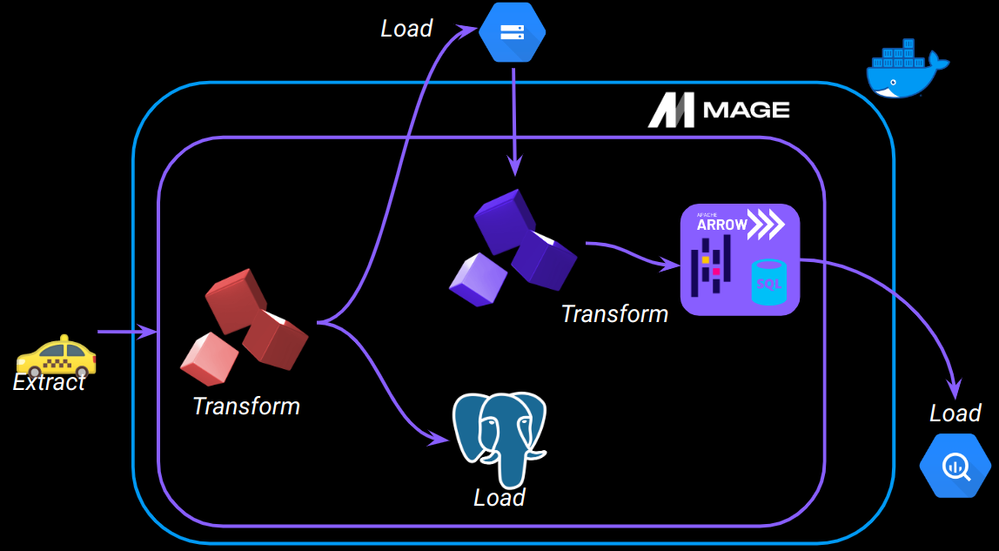
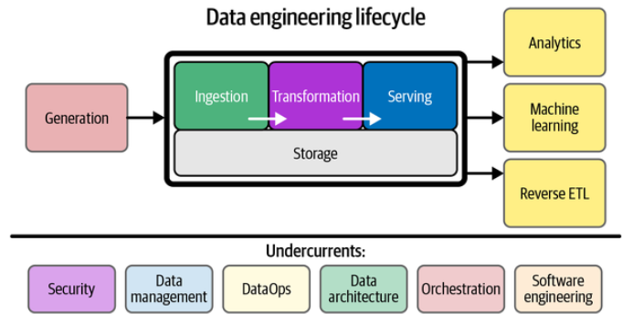
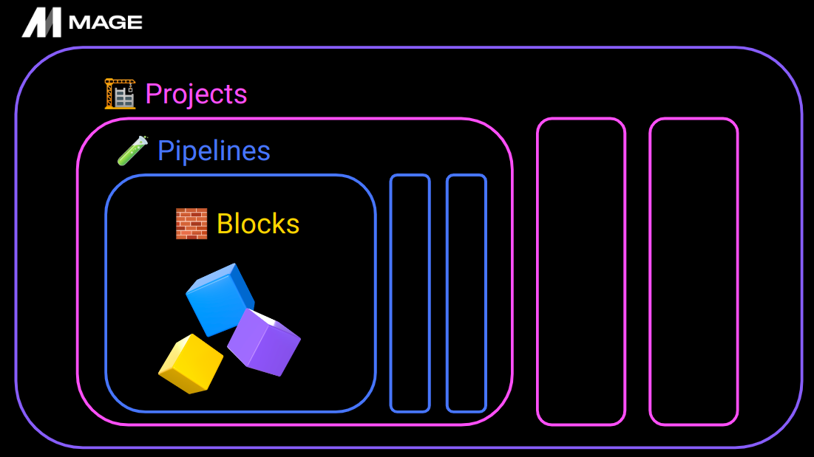

# Module 2 - Workflow orchestration

> Course video sources: videos `2.2.x` from the [DE Zoomcamp playlist](https://www.youtube.com/watch?v=Li8-MWHhTbo&list=PL3MmuxUbc_hJed7dXYoJw8DoCuVHhGEQb).


## Table of contents

* [What will we build?](#what-will-we-build).
* [Intro to orchestration](#intro-to-orchestration).
* [Intro to Mage](#intro-to-mage).
    + What is Mage?.
    + Mage setup.
    + Configuring Postgres.
* [ETL: API to Postgres](#etl-api-to-postgres).
    + Data loader.
    + Transformer.
    + Data exporter.
* [ETL: API to GCS](#etl-api-to-gcs).
    + Configuring GCP.
    + Writing an ETL pipeline.
        - Writing to partitioned parquet files.
* [ETL: GCS to BigQuery](#etl-gcs-to-bigquery).
    + Data loader.
    + Transformer.
    + Data exporter.
* [Scheduling](#scheduling).
* [Parameterized execution](#parameterized-execution).
    + Backfills.
* [Deployment](#deployment).
    + Deployment prerequesites.
    + Google Cloud permissions.
    + Deploying to Google Cloud.
* [Module 2 Homework](./homework/).


## What will we build?



**Extract:** pull data from a source (API - NYC dataset).  
**Transform:** data cleaning, transformation, and partitioning.  
**Load:** API to Mage, Mage to Postgres, GCS, BigQuery.


## Intro to orchestration

Resources: [Slides](https://docs.google.com/presentation/d/17zSxG5Z-tidmgY-9l7Al1cPmz4Slh4VPK6o2sryFYvw).

A large part of data engineering is **extracting**, **transforming**, and **loading** data between sources. **Orchestration** is a process of dependency management, facilitated through **automation**. The data orchestrator manages scheduling, triggering, monitoring, and even resource allocation.

Every workflow requires sequential steps:
* Steps = tasks.
* Workflows = DAGs.



As one of the undercurrents, orchestration is key to the entire process of building data engineering pipelines.

**A good orchestrator handles:**
* Workflow management.
* Automation.
* Error handling.
* Recovery.
* Monitoring, alerting.
* Resource optimization.
* Observability.
* Debugging.
* Compliance/auditing.


## Intro to Mage

Resources:
* [Getting started repo](https://github.com/mage-ai/mage-zoomcamp).
* [Slides](https://docs.google.com/presentation/d/1y_5p3sxr6Xh1RqE6N8o2280gUzAdiic2hPhYUUD6l88).


### What is Mage?

[Mage](https://www.mage.ai/) is an open-source pipeline tool for orchestrating, transforming, and integrating data.


**Main concepts in Mage:**
* **Project** 
    + It forms the basis for all the work you can do in Mage; like a repository on GitHub.
    + It contains all the code for all of your pipelines, blocks, and other assets.
    + A Mage instance has one or more projects.
* **Pipeline**
    + Workflow that executes some data operation; also called DAGs on other platforms.
    + Contains references to all the blocks of code you want to run (written in SQL, Python, or R), charts for visualizing data, and organizes the dependency between each block of code.
    + Each pipeline is represented by a YAML file in the _pipelines_ folder of your project.
* **Block:** 
    + A file with code that can be executed independently or within a pipeline. Commonly in data engineering we use blocks to export, transform, and load data.
    + Together, blocks form pipelines (DAGs).
    + A block won't start running in a pipeline until all its upstream dependencies are met.





Visit the [docs page](https://docs.mage.ai/introduction/overview) to find more information on these and other Mage concepts.


### Mage setup

For this section we make use of the [Mage Getting started repo](https://github.com/mage-ai/mage-zoomcamp/tree/master). Instead of cloning it and creating a new repository, we download the project files, and copy those we need. These starting files are:
* Dockerfile.
* Docker compose file.
* requirements.txt.
* dev.env

Copy `dev.env` as `.env`.


(Build, if necessary, and) start the container.
```bash
docker compose up -d
```

Now, navigate to `localhost:6789` in your browser to access Mage UI.


**Mage repository structure**  
We just initialized a new mage repository. It will be present in your project under the name `magic-zoomcamp`. If you changed the varable `PROJECT_NAME` in the `.env` file, it will be named whatever you set it to.

This repository should have the following structure:

```
.
├── mage_data
│   └── magic-zoomcamp
├── magic-zoomcamp
│   ├── __pycache__
│   ├── charts
│   ├── custom
│   ├── data_exporters
│   ├── data_loaders
│   ├── dbt
│   ├── extensions
│   ├── interactions
│   ├── pipelines
│   ├── scratchpads
│   ├── transformers
│   ├── utils
│   ├── __init__.py
│   ├── io_config.yaml
│   ├── metadata.yaml
│   └── requirements.txt
├── Dockerfile
├── README.md
├── dev.env
├── .env
├── docker-compose.yml
└── requirements.txt
```


In order to be able to see and modify files out of the Mage UI (for example, in VSCode), change the ownership of `magic-zoomcamp` and `mage_data` directories.
```bash
sudo chown -R <your-user>:<your-group> magic-zoomcamp mage_data
```


### Configuring Postgres

In this section, we configure a Postgres client in Mage to connect to a local Postgres database, which exists in a Docker container (started along with Mage via Docker Compose).

In order to connect Mage with that Postgres instance, edit the `io_config.yaml` file (inside `magic-zoomcamp` directory). This file is where we manage our connections.

There, create a new connection profile, `dev` (useful, for example, for separating dev and production environment), and add your Postgres credentials. Mage uses [Jinja](https://jinja.palletsprojects.com/en/3.1.x/) templating and `env_var()` function to interpolate environment variables.

```yml
dev:
  # PostgresSQL
  POSTGRES_CONNECT_TIMEOUT: 10
  POSTGRES_DBNAME: "{{ env_var('POSTGRES_DBNAME') }}"
  POSTGRES_SCHEMA: "{{ env_var('POSTGRES_SCHEMA') }}"
  POSTGRES_USER: "{{ env_var('POSTGRES_USER') }}"
  POSTGRES_PASSWORD: "{{ env_var('POSTGRES_PASSWORD') }}"
  POSTGRES_HOST: "{{ env_var('POSTGRES_HOST') }}"
  POSTGRES_PORT: "{{ env_var('POSTGRES_PORT') }}"
```

Once Postgres is configured, we can check if the connection is successful by creating a `test_postgres` SQL data loader with the query `SELECT 1;`. If it returns a 1 after a "Postgres initialized" message, then the connection to our Postgres local instance is well established.


## ETL: API to Postgres

We are going to load data from an API that takes the form of a compressed CSV file to our local Postgres database. Our pipeline will pull data, perform a light transformation, and write it to the database.

In the UI, start a new batch pipeline, and rename it as `api_to_postgres`.


### Data loader

To create a new data loader, use the API template and name the block `load_api_data`.

In this example, we use the [NY Yellow Taxi dataset](https://github.com/DataTalksClub/nyc-tlc-data) from January 2021.

There, you need to map data types to process the dataset more efficiently. To see the schema and what data types to expect, you can make use of the [upload_data.ipynb notebook](../01_containerization_and_iac/1_docker_postgres/upload_data.ipynb) from module 1. Also, as we did in the previous module, make sure `tpep_pickup_datetime` and `tpep_dropoff_datetime` columns are loaded in date format.

After applying the appropriate changes, the data loader (and its template test function) looks like is shown below.

```py
import io
import pandas as pd
import requests
if 'data_loader' not in globals():
    from mage_ai.data_preparation.decorators import data_loader
if 'test' not in globals():
    from mage_ai.data_preparation.decorators import test


@data_loader
def load_data_from_api(*args, **kwargs):
    url = 'https://github.com/DataTalksClub/nyc-tlc-data/releases/download/yellow/yellow_tripdata_2021-01.csv.gz'

    taxi_dtypes = {
        "VendorId": pd.Int64Dtype(),
        "passenger_count": pd.Int64Dtype(),
        "trip_distance": float,
        "RatecodeID": pd.Int64Dtype(),
        "store_and_fwd_flag": str,
        "PULocationID": pd.Int64Dtype(),
        "DOLocationID": pd.Int64Dtype(),
        "payment_type": pd.Int64Dtype(),
        "fare_amount": float,
        "extra": float,
        "mta_tax": float,
        "tip_amount": float,
        "tolls_amount": float,
        "improvement_surcharge": float,
        "total_amount": float,
        "congestion_surcharge": float
    }

    # native date parsing
    parse_dates_cols = ["tpep_pickup_datetime", "tpep_dropoff_datetime"]

    return pd.read_csv(
        url,
        sep=",",
        dtype=taxi_dtypes,
        parse_dates=parse_dates_cols,
        compression="gzip"
    )


@test
def test_output(output, *args) -> None:
    """
    Template code for testing the output of the block.
    """
    assert output is not None, 'The output is undefined'
```


### Transformer

Next, add a transformer using the generic Python template, and name the block `transform_taxi_data`. This transformer will remove records with value 0 for `passenger_count`. In addition, add a test to check that there are no rides with zero passengers after the transformation is done.

Below is the block of code for this transformer.

```py
if 'transformer' not in globals():
    from mage_ai.data_preparation.decorators import transformer
if 'test' not in globals():
    from mage_ai.data_preparation.decorators import test


@transformer
def transform(data, *args, **kwargs):
    print(f"Records with zero passengers: {len(data[data['passenger_count'] == 0])}")

    return data[data["passenger_count"] > 0]


@test
def test_output(output, *args) -> None:
    assert not any(output['passenger_count'] == 0), "There are rides with zero passengers!"
```


### Data exporter

Last step, add a data exporter using the PostgreSQL template. Name it as `taxi_data_to_postgres`.

There, modify the value of these variables: `schema_name`, `table_name`, and `config_profile`, as shown below.

```py
from mage_ai.settings.repo import get_repo_path
from mage_ai.io.config import ConfigFileLoader
from mage_ai.io.postgres import Postgres
from pandas import DataFrame
from os import path

if 'data_exporter' not in globals():
    from mage_ai.data_preparation.decorators import data_exporter


@data_exporter
def export_data_to_postgres(df: DataFrame, **kwargs) -> None:
    """
    Template for exporting data to a PostgreSQL database.
    Specify your configuration settings in 'io_config.yaml'.

    Docs: https://docs.mage.ai/design/data-loading#postgresql
    """
    schema_name = "ny_taxi"  # Specify the name of the schema to export data to
    table_name = "yellow_taxi_data"  # Specify the name of the table to export data to
    config_path = path.join(get_repo_path(), 'io_config.yaml')
    config_profile = "dev"

    with Postgres.with_config(ConfigFileLoader(config_path, config_profile)) as loader:
        loader.export(
            df,
            schema_name,
            table_name,
            index=False,  # Specifies whether to include index in exported table
            if_exists='replace',  # Specify resolution policy if table name already exists
        )
```


As in [Configuring Postgres](#configuring-postgres) section, you can create a SQL data loader just to check if the data has been correctly loaded (for example with a `SELECT * FROM ny_taxi.yellow_taxi_data LIMIT 10;` query).


## ETL: API to GCS

We've written data ocally to a database. In this section, we'll walk through the process of using Mage to extract, transform, and load data from an API to Google Cloud Storage (GCS).


### Configuring GCP

* Create (or reuse an existing) GCS bucket.
* Create a service account for connecting Mage to GCP.
    + Service account name: _mage-zoomcamp_.
    + Grant roles: Owner.
* Service account key.
    + Download the JSON file, rename it as `google_credentials_mage.json` and move it to the Mage project root directory, since we have bind-mounted it to `/home/src/` in the Mage container when we started the service.
    + Edit the Google connection in the `io_config.yaml` file. In this case we can do it directly in the `default` profile, as if it were the production environment.
        ```yml
        # Google
        GOOGLE_SERVICE_ACC_KEY_FILEPATH: "/home/src/google_credentials_mage.json"
        GOOGLE_LOCATION: EU # Optional
        ```
* Test the connection to GCP:
    + BigQuery: you can create a new SQL data loader, or reuse the one created earlier (`test_postgres`), indicating a BigQuery connection and default profile, and finally running the `SELECT 1;` query.
    + Cloud Storage:
        - Upload a CSV file to GCS.
        - Create a Python Google Cloud Storage data loader (name it as `test_gcs`) and edit the following values:
            ```py
            bucket_name = "<your bucket name>"
            object_key = "<your file name>"
            ```
        - Run the block and check if you get the expected output.


### Writing an ETL pipeline

We are going to load the same dataset that we did for Postgres, so we can reuse both the data loader and the transformer.

In the UI, start a new batch pipeline, and rename it as `api_to_gcs`. There you can just drag and drop `load_api_data.py` and `transform_taxi_data.py` scripts from the project tree view to the Notebook area situated in the center of the console. Then, from the tree view of the pipeline, connect both blocks, so that the output of the former corresponds to the input of the latter.

Next, create a Google Cloud Storage data exporter and name it as `taxi_data_to_gcs_parquet`, and make sure it's attached to the transformer. In the script, edit the following variables:
* bucket_name = "<your bucket name>"
* object_key = "nyc_taxi_data.parquet". From this, Mage is going to infer the parquet format.

Execute the whole pipeline.

Once this is done, you should see the parquet file in the Google Cloud Storage bucket.


#### Writing to partitioned parquet files

For large datasets we may not want to write all the data to a single parquet files, but to a partitioned parquet file structure. Partitioning means to break a dataset by some attribute. Partitioning by date is often useful, because it may create an even distribution and it's also a natural way to query data.

To implement it, we're going to use the [PyArrow](https://arrow.apache.org/docs/python/index.html) library.

Create a Python generic data exporter and name it as `taxi_data_to_gcs_partitioned_parquet`. Make sure it's directly connected to the transformer.

It's necessary to define where our credentials live. Instead of doing it through the config file (as it's done in `taxi_data_to_gcs_parquet` exporter), this time we're going to do it manually.

Other variables needed `bucket_name`, `project_id`, `table_name`, and `root_path` (which actually is a combination of the bucket and the table names). Under the root path we'll have all the partitioned files.

We want to partition by date, but we don't have a date column in the dataset, so we need to create it from the datetime ones.

Then, to work with PyArrow, we need to define what's called a [PyArrow table](https://arrow.apache.org/docs/python/generated/pyarrow.Table.html) and read our pandas dataframe into it.

We also have to define a [GCS filesystem object](https://arrow.apache.org/docs/python/generated/pyarrow.fs.GcsFileSystem.html), which is going to authorize using our environment variable `GOOGLE_APPLICATION_CREDENTIALS` automatically.

Finally we use the [parquet write_to_dataset method](https://arrow.apache.org/docs/python/generated/pyarrow.parquet.write_to_dataset.html).

Here is the script for the data exporter we just created.

```py
import pyarrow as pa
import pyarrow.parquet as pq
import os

if 'data_exporter' not in globals():
    from mage_ai.data_preparation.decorators import data_exporter


os.environ["GOOGLE_APPLICATION_CREDENTIALS"] = "/home/src/google_credentials_mage.json"
bucket_name = "<your bucket name>"
project_id = "<your project ID>"
table_name = 'nyc_taxi_data'
root_path = f"{bucket_name}/{table_name}"


@data_exporter
def export_data(data, *args, **kwargs):
    data["tpep_pickup_date"] = data["tpep_pickup_datetime"].dt.date
    table = pa.Table.from_pandas(data)
    gcs = pa.fs.GcsFileSystem()

    pq.write_to_dataset(
        table=table,
        root_path=root_path,
        partition_cols=["tpep_pickup_date"],
        filesystem=gcs,
    )
```

Once it's successfully run, you will find in your GCS bucket the table `nyc_taxi_data` partitioned by date.


## ETL: GCS to BigQuery

In this we'll go over how to use Mage to load our data from GCS (data lake) to BigQuery (data warehouse). For this demo, we'll use the unpartitioned file.


### Data loader

Start a new batch pipeline and name it as `gcs_to_bigquery`. Create a Google Cloud Storage data loader and name it as `load_taxi_gcs`. In the script, edit the following variables:
* bucket_name = "<your bucket name>"
* object_key = "nyc_taxi_data.parquet".


### Transformer

A best practice in data engineering is to standarize column names, so this is what we're going to do in the transformation step. Add a transformer using the generic Python template, and name the block `transform_staged_data`.

This transformation consists in replaceing any spaces with underscores and lower any capital letters.

The script for the transformer is presented below.

```py
if 'transformer' not in globals():
    from mage_ai.data_preparation.decorators import transformer
if 'test' not in globals():
    from mage_ai.data_preparation.decorators import test


@transformer
def transform(data, *args, **kwargs):
    data.columns = (data.columns
                    .str.replace(" ", "_")
                    .str.lower()
                    )

    return data
```


### Data exporter

Finally, let's export the data to BigQuery, with a new SQL data exporter that we call `taxi_data_to_bigquery`. For this, use the BigQuery default connection.

Mage allows you to select data directly from the dataframe. Instead of writing a raw SQL query, indicate `ny_taxi` as the schema and `yellow_taxi_data` as the table name. Then write the query `SELECT * from {{ df_1 }}`, which will select all the rows from the previous dataframe and export them to our NY taxi schema and table.

After the execution is completed, you can check in BigQuery that the data has been correctly loaded.


## Scheduling

To schedule your workflows, inside the pipeline, create a new trigger. For this example, choose a schedule trigger type. Name it as `gcs_to_bigquery_schedule` and select a daily frequency. Save the changes and enable the trigger.

This way, you'll have your workflow scheduled and active in Mage.

You can also [configure triggers through code](https://docs.mage.ai/orchestration/triggers/configure-triggers-in-code) using a `triggers.yaml` file under pipeline folder.


## Parameterized execution

In this section we'll see how to load partial datasets or load datasets that depend on some parameter. This is frequently referred to as parameterized execution: we have a DAG or pipeline, and its execution is dependent on some variable that we're supplying to the DAG.

In Mage there are different types of [variables](https://docs.mage.ai/development/variables/overview). Here we'll introduce [runtime variables](https://docs.mage.ai/getting-started/runtime-variable) and how they work.

In our specific example, we're going to use the Taxi dataset that we already loaded and show how you can create a different file for each day that your job is being run.

To illustrate it, we'll use our `api_to_gcs` previous example and clone it (in the UI, go to the pipelines section and right clic on the one you want to clone). This will create an exact copy of the pipeline. Name it as `api_to_gcs_parameterized`.

Delete the `taxi_data_to_gcs_partitioned_parquet` exporter block. Since what we change in a block will affect all the pipelines where the block is, create a new generic data exporter, name it as `taxi_data_to_gcs_parameter` and copy the code from the `taxi_data_to_gcs_parquet` data exporter; after that, remove this last one from the pipeline.

Edit the block so that the data is saved in GCS based on the execution date, using a nested folder structure: `YYYY/MM/DD/daily_trips.parquet`. The runtime variable `execution_date` can be accessed via the `**kwargs` parameter in your block function, as presented below.

```py
@data_exporter
def export_data_to_google_cloud_storage(df: DataFrame, **kwargs) -> None:
    now = kwargs.get("execution_date")
    now_fpath = now.strftime("%Y/%m/%d")


    config_path = path.join(get_repo_path(), 'io_config.yaml')
    config_profile = 'default'

    bucket_name = '<your bucket name>'
    object_key = f"{now_fpath}/daily_trips.parquet"

    print(object_key)

    GoogleCloudStorage.with_config(ConfigFileLoader(config_path, config_profile)).export(
        df,
        bucket_name,
        object_key,
    )
```


This was an example of a built-in parameterized execution, but there are also a number of custom ways to do this, so for example if you're triggering pipelines through an API in Mage you can supply parameters that way. You can also define [global variables](https://docs.mage.ai/getting-started/runtime-variable#creating-runtime-variables) from the pipeline editor view, by editing the pipeline `metadata.yaml` file, or inside the script.


### Backfills

Imagine you lost some data, or you had missing data, and you need to rerun those pipelines for multiple days, weeks, or months. Mage allows you to easily replicate lost data, or data for parameterized runs that you need to backfill. This can be very useful to backfill pipelines that depend on some variable, such as the execution date. Check out the documentation on [Backfilling pipelines](https://docs.mage.ai/orchestration/backfills/overview) for more details.

From the pipeline view, click on _Backfills_ and create a new backfill with the appropriate settings:
* Backfill name.
* Start date and time.
* End date and time.
* Interval type.
* Interval units.

We use the parameterized exporter from the previous example, where we have a runtime `execution_date` variable. This is going to create a number of runs (based on the dates and interval type) and is going to assign the `execution_date` variable to each day, according to what we indicate in the backfill settings. Once is saved, we can just start the backfill.


## Deployment

In this section, we'll cover deploying Mage onto Google Cloud using Terraform.


### Deployment prerequesites

* Terraform.
* Google Cloud CLI.
* Google Cloud permissions to allow our service account to create the resources that will be necessary for our Mage project.
* [Mage Terraform templates](https://github.com/mage-ai/mage-ai-terraform-templates).


### Google Cloud permissions

Once we have Terraform and Google Cloud CLI installed in our machine (already done in Module 1), we need to create permissions to run our Mage project. As specified in the [documentation on how to deploy to GCP with Terraform](https://docs.mage.ai/production/deploying-to-cloud/gcp/setup) these are the permissions we need:

* Artifact Registry Reader.
* Artifact Registry Writer.
* Cloud Run Developer.
* Cloud SQL Admin.
* Service Account Token Creator.

In the Google Cloud console, go to the IAM management dashboard and add the roles from above to the service account that will be used. Note that we already have an _Owner_ role, so this isn't actually necessary; but it's not a good practice to create roles with so many permissions ([Principle of least privilege](https://en.wikipedia.org/wiki/Principle_of_least_privilege)), so we should have the minimum permissions needed to do our work.


### Deploying to Google Cloud

Instead of in our local machine, we are now going to spin up our own Mage server in Google Cloud using one of the Mage Terraform templates.

* Check that Google Cloud CLI is correctly installed and configured. To do so, you can run one of these commands:
    ```bash
    # list the authorized accounts
    gcloud auth list

    # list the buckets in your GC instance
    gcloud storage ls
    ```

* Clone or download [Mage's Terraform template repository](https://github.com/mage-ai/mage-ai-terraform-templates). We're only interested in the GCP Terraform files, which can be found in the `gcp` folder.

* [Customize Terraform settings](https://docs.mage.ai/production/deploying-to-cloud/gcp/setup#3-customize-terraform-settings).
    + `variables.tf`.
        - _project_id_.
        - _region_.
        - _zone_.
        - _app_name_.
        - _repository_.
        - Add _credentials_ variable.
            ```tf
            variable "credentials" {
              description = "Your credentials."
              default     = "~/.google/credentials/google_credentials.json"
            }
            ```
    * `main.tf`.
        - Add a reference to the credentials in the provider section.
            ```tf
            provider "google" {
                credentials = file(var.credentials)
                project     = var.project_id
                region      = var.region
                zone        = var.zone
            }
            ```

* Deploy the infrastructure, following [documentation](https://docs.mage.ai/production/deploying-to-cloud/gcp/setup#4-deploy).


## Module 2 Homework

[Link](./homework/).