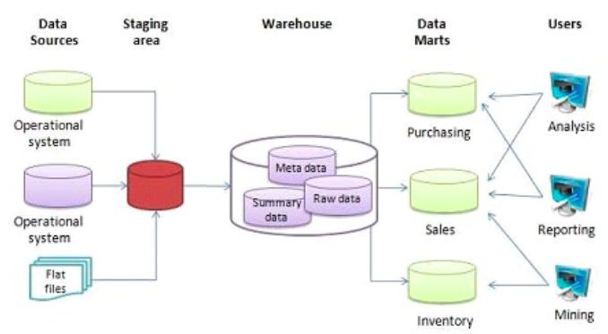
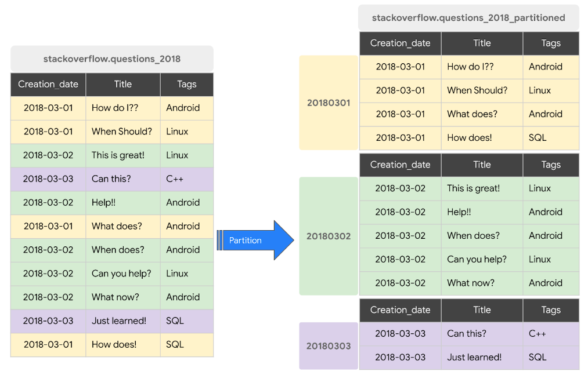
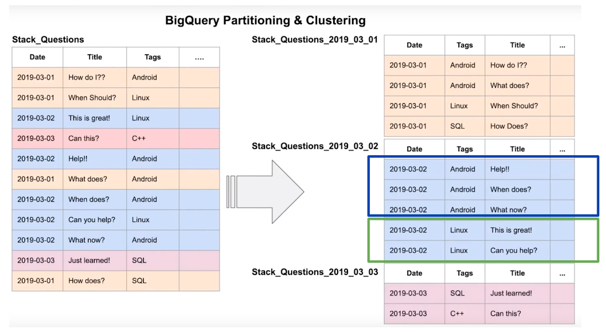
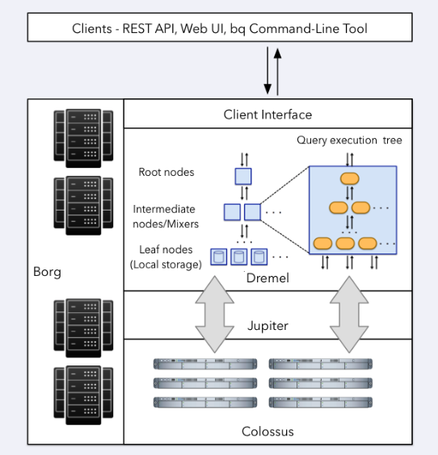
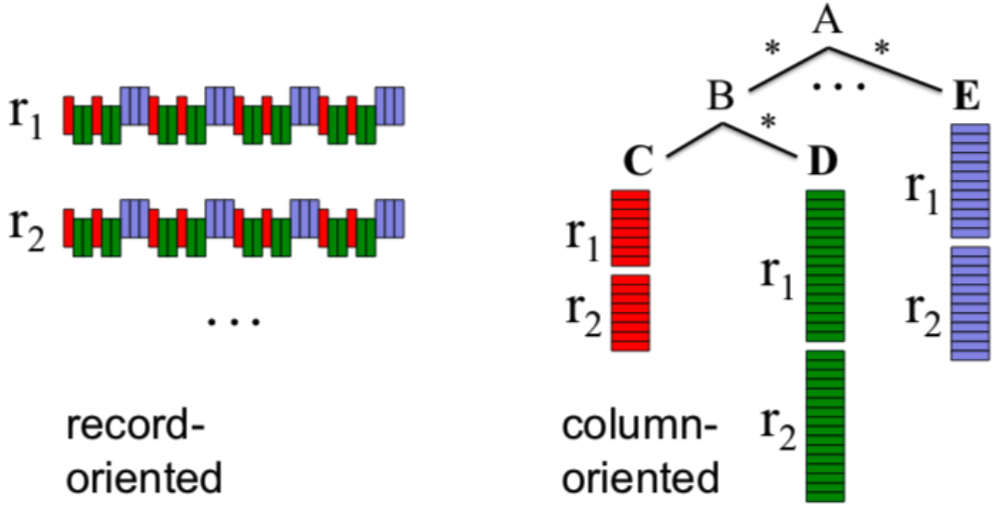
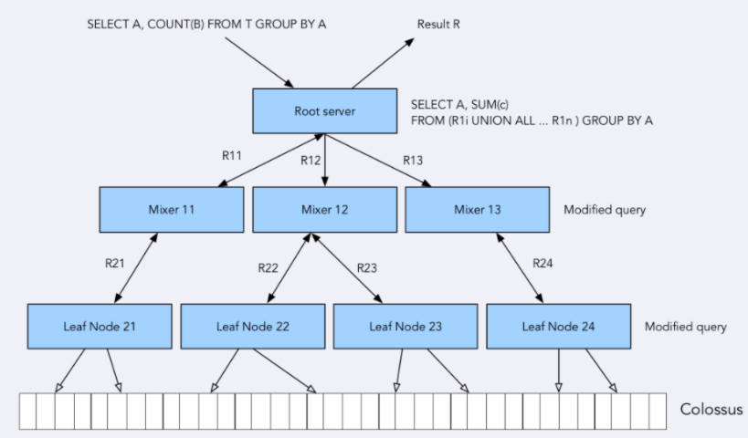
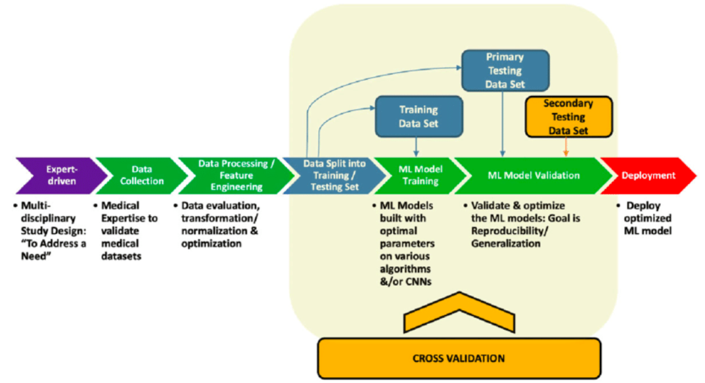

# Module 3 - Data Warehouse

> Course video sources: videos `3.x.x` from the [DE Zoomcamp playlist](https://www.youtube.com/watch?v=jrHljAoD6nM&list=PL3MmuxUbc_hJed7dXYoJw8DoCuVHhGEQb).  
> Other resources: [Slides](./data_warehouse_slides.pdf).


## Table of contents

* [OLTP vs OLAP](#oltp-vs-olap).
* [What is a Data Warehouse?](#what-is-a-data-warehouse).
* [Introduction to BigQuery](#introduction-to-bigquery).
    + External data sources.
    + Partitioning in BigQuery.
    + Clustering in BigQuery.
    + Partitioning vs clustering.
* [BigQuery best practices](#bigquery-best-practices).
    + Cost reduction.
    + Query performance improvement
* [Internals of BigQuery](#internals-of-bigquery).
    + BigQuery architecture.
* [Machine Learning in BigQuery](#machine-learning-in-bigquery).
    + BigQuery ML example.
    + BigQuery ML deployment.
* [Module 3 Homework](./homework/).


## OLTP vs OLAP


|   | **OLTP** (Online Transaction Processing) | **OLAP** (Online Analytical Processing) |
|---|---|---|
| Purpose | Control and run essential business operations in real time (transactions); typically in backend services | Used for analytical purposes: plan, solve problems, support decisions, discover hidden insights |
| Data updates | Frequent, short, fast updates initiated by user  | Data periodically refreshed with scheduled, long-running batch jobs |
| Query types | Simple | Complex, usually require aggregation |
| Data sources | Real-time transactional data | Aggregated data from transactions / OLTP |
| Database design | Normalized databases for efficiency | Denormalized databases for analysis |
| Implementation approach | Traditional row-oriented databases | Columnar databases |
| Space requirements | Generally small if historical data is archived | Generally large due to aggregating large datasets |
| Backup and recovery | Regular backups required to ensure business continuity and meet legal and governance requirements | Lost data can be reloaded from OLTP database as needed in lieu of regular backups |
| Productivity | Increase productivity of end users | Increase productivity of business managers, data analysts and executives |
| Key performance measurement | Number of transactions per second | Query response times |
| User examples | Customer-facing personnel, clerks, online shoppers | Knowledge workers such as data analysts, business analysts and executives |


## What is a Data Warehouse?

Data Warehouse is an OLAP solution used for reporting and data analysis. Data Warehouses use the ETL approach, in contrast to the ELT approach of Data Lakes.

A DW receives data from different data sources (OLTP databases, flat files, ...) which is then processed in a staging area before being ingested to the actual warehouse (a database) and arranged as needed. DWs may then feed data into separate Data Marts: smaller database systems which end users may use for different purposes.





## Introduction to BigQuery

The SQL queries associated with this lesson may also be found in [big_query.sql](./scripts/big_query.sql).

[BigQuery (BQ)](https://cloud.google.com/bigquery) is a Cloud Data Warehouse solution from Google. It presents several strengths:
* Is is serverless. There are no servers to manage or database software to install.
* High scalability and availability. Google takes care of the underlying infrastructure and software.
* It has several built-in features like Machine Learning, Geospatial Analysis or Business Intelligence.
* It maximizes flexibility by separating the compute engine that analyzes your data from your storage. This allows customers to budget acordingly and reduce costs.


### External data sources

BigQuery allows to query data that is not stored in BQ storage, which are called [external data sources](https://cloud.google.com/bigquery/docs/external-data-sources).

External tables are similar to standard BigQuery tables, in that these tables store their metadata and schema in BigQuery storage. However, their data resides in an external source.

We can [create an external table](https://cloud.google.com/bigquery/docs/external-data-cloud-storage#sql) from CSV or Parquet files stored in a GCS bucket. The query below creates an external table based on Parquet files. BQ will figure out the table schema and the datatypes based on the contents of the files. Be aware that BQ cannot determine processing costs of external tables.

```sql
-- Creating external table referring to gcs path
CREATE OR REPLACE EXTERNAL TABLE <project_id>.ny_taxi.external_yellow_taxi_data
OPTIONS (
  format = 'Parquet',
  uris = ['gs://<bucket_name>/yellow/yellow_tripdata_2019*.parquet',
          'gs://<bucket_name>/yellow/yellow_tripdata_2020*.parquet']
);
```

We can import an external table into BQ as a regular internal table.

```sql
-- Create a non partitioned table from external table
CREATE OR REPLACE TABLE <project_id>.ny_taxi.yellow_taxi_data_non_partitioned AS
SELECT * FROM <project_id>.ny_taxi.external_yellow_taxi_data;
```


### Partitioning in BigQuery

When we create a dataset, we generally have one or more columns that are used as some type of filter. In this case, we can partition a table based on such columns into multiple smaller tables. [Partitioned tables](https://cloud.google.com/bigquery/docs/partitioned-tables) are very useful to improve performance and reduce costs, because BQ will not process as much data per query.

We can choose to partition a table by different type of attributes or columns:
* Time-unit column: based on a _DATE_, _TIMESTAMP_ or _DATETIME_ column in the table.
* Ingestion time (_\_PARTITIONTIME_): based on the time when BQ ingests the data.
* Integer range: based on ranges of values in a specific _INTEGER_ column.

When using time-unit or ingestion time partitioning, the partition may be daily (the default option), hourly, monthly or yearly.

Notice that BQ limits the number of partitions to 4000 per table.




To illustrate the difference in performance, we first create a partitioned table from the same external source as our non-partitioned table created before.

```sql
-- Create a partitioned table from external table
CREATE OR REPLACE TABLE <project_id>.ny_taxi.yellow_taxi_data_partitioned
PARTITION BY
  DATE(tpep_pickup_datetime) AS
SELECT * FROM <project_id>.ny_taxi.external_yellow_taxi_data;
```

Then we compare the impact of partitioning in performance by running the same query on both tables (to get reliable results, we must disable _Used cached results_ from _Query settings_).

```sql
-- Impact of partition
-- Non-partitioned
SELECT DISTINCT(VendorID), passenger_count, tip_amount, total_amount, trip_distance
FROM <project_id>.ny_taxi.yellow_taxi_data_non_partitioned
WHERE DATE(tpep_pickup_datetime) BETWEEN '2019-01-01' AND '2019-01-31';

-- Partitioned
SELECT DISTINCT(VendorID), passenger_count, tip_amount, total_amount, trip_distance
FROM <project_id>.ny_taxi.yellow_taxi_data_partitioned
WHERE DATE(tpep_pickup_datetime) BETWEEN '2019-01-01' AND '2019-01-31';
```


We can check the size of each partition in a partitioned table, and in this way see if there are data imbalances and/or biases in our partitions.

```sql
-- Let's look into the partitons
SELECT table_name, partition_id, total_rows
FROM `ny_taxi.INFORMATION_SCHEMA.PARTITIONS`
WHERE table_name = 'yellow_taxi_data_partitioned'
ORDER BY total_rows DESC;
```


### Clustering in BigQuery

Besides partitioning, there is another useful operation called [clustering](https://cloud.google.com/bigquery/docs/clustered-tables). This consists in rearranging a table based on the values of its columns so that the table is ordered according to any criteria. Clustering can be done based on one or multiple columns (up to 4), and the order in which cluster columns are specified determines the priority. The field(s) that we choose for clustering depends on how the data will be queried.

Clustering may improve performance and lower costs on big datasets for certain types of queries, such as queries that use filter clauses and queries that aggregate data.

The clustering columns must be top-level and non-repeated. It is possible to choose the following types for our clustering columns:
_DATE_, _BOOL_, _GEOGRAPHY_, _INT64_, _NUMERIC_, _BIGNUMERIC_, _STRING_, _TIMESTAMP_, _DATETIME_.





In the example below we create a partitioned and clustered table.

```sql
-- Creating a partition and cluster table
CREATE OR REPLACE TABLE <project_id>.ny_taxi.yellow_taxi_data_partitioned_clustered
PARTITION BY DATE(tpep_pickup_datetime)
CLUSTER BY VendorID AS
SELECT * FROM <project_id>.ny_taxi.external_yellow_taxi_data;
```

Similarly to what we previously did, we compare performance between queries on both the partitioned table and the partitioned and clustered table.

```sql
-- Impact of clustering
-- Partitioned
SELECT count(*) as trips
FROM <project_id>.ny_taxi.yellow_taxi_data_partitioned
WHERE DATE(tpep_pickup_datetime) BETWEEN '2019-01-01' AND '2019-02-15'
  AND VendorID=1;

--Partitioned and clustered
SELECT count(*) as trips
FROM <project_id>.ny_taxi.yellow_taxi_data_partitioned_clustered
WHERE DATE(tpep_pickup_datetime) BETWEEN '2019-01-01' AND '2019-02-15'
  AND VendorID=1;
```

Note that tables with less than 1GB do not show significant improvement with partitioning and clustering; doing so in a small table could even lead to increased cost due to the additional metadata reads and maintenance needed for these features.


### Partitioning vs clustering

There may be scenarios when we want to choose one of these operations or both of them. So it's important to know what are the differences between partitioning and clustering to decide what should be used for a specific scenario.

| **Clustering** | **Partitioning** |
|---|---|
| Cost benefit unknown. BQ cannot estimate the reduction in cost before running a query. | Cost known upfront. BQ can estimate the amount of data to be processed before running a query. |
| High granularity. Multiple criteria can be used to sort the table. | Low granularity. Only a single column can be used to partition the table. |
| Clusters are "fixed in place". | Partitions can be added, deleted, modified or even moved between storage options. |
| Benefits from queries that commonly use filters or aggregation against multiple particular columns. | Benefits when you filter or aggregate on a single column. |
| Unlimited amount of clusters; useful when the cardinality of the number of values in a column or group of columns is large. | Limited to 4000 partitions; cannot be used in columns with larger cardinality. |


You may choose clustering over partitioning in scenarios like these:
* When partitioning results in a small amount of data per partition (approximately less than 1 GB).
* When partitioning would result in over 4000 partitions (which is the limit for partitioning a table).
* If your mutation operations modify the majority of partitions in the table frequently (for example, writing to the table every few minutes and writing to most of the partitions each time).

BigQuery benefits from [**automatic reclustering**](https://cloud.google.com/bigquery/docs/clustered-tables#automatic_reclustering):
* As data is added to a clustered table, the newly inserted data can be written to blocks that contain key ranges that overlap with the key ranges in previously written blocks. This overlapping keys weaken the sort property of the table.
* To maintain the performance characteristics of a clustered table, BQ performs automatic reclustering in the background to restore the sort property of the table. In this way, clustering is maintained for data within the scope of each partition.


## BigQuery best practices

### Cost reduction

* Avoid using `SELECT *`. BQ stores the data in [columnar format](https://cloud.google.com/bigquery/docs/storage_overview#storage_layout). It's much better to specify a particular subset of columns to reduce the amount of scanned data.
* Price your queries before running them.
* Use clustered or partitioned tables if possible.
* Use [streaming inserts](https://cloud.google.com/bigquery/docs/streaming-data-into-bigquery) with caution, since they can drastically increase the costs.
* [Materialize query results](https://cloud.google.com/bigquery/docs/materialized-views-intro) into different stages.


### Query performance improvement

* Filter your data on the partition column and/or on the clustered columns.
* Try to denormalize your data to facilitate analytical queries.
* In case you have a complicated structure, you should use [nested or repeated columns](https://cloud.google.com/blog/topics/developers-practitioners/bigquery-explained-working-joins-nested-repeated-data).
* Use external data sources appropriately. Constantly reading data from a bucket may incur in additional costs and has worse performance.
* Reduce data before performing a join operation.
* Do not treat WITH clauses as prepared statements.
* [Partitioning is recommended over table sharding](https://cloud.google.com/bigquery/docs/partitioned-tables#dt_partition_shard).
* Avoid JavaScript user-defined functions.
* Use [approximate aggregation functions](https://cloud.google.com/bigquery/docs/reference/standard-sql/approximate_aggregate_functions).
* Order statements must be last part of the query to maximize performance.
* [Optimize your join patterns](https://cloud.google.com/bigquery/docs/best-practices-performance-compute#optimize_your_join_patterns):
    * As a best practice, place the table with the largest number of rows first (it will be evenly distributed), followed by the table with the fewest rows (it will be broadcasted to all the nodes), and then place the remaining tables by decreasing size.


## Internals of BigQuery

### BigQuery architecture




Under the hood, BigQuery is [built mainly on top of 4 Google technologies](https://cloud.google.com/blog/products/bigquery/bigquery-under-the-hood):
* ***Dremel***: query execution engine (the compute part).
  * Turns SQL queries into _execution trees_. 
  * The leaves of these trees are called _slots_, and the branches are called _mixers_.
    * The _slots_ do the heavy lifting of reading data from storage and any necessary computation.
    * The _mixers_ perform the aggregation.
  * Dremel dynamically apportions slots to queries on an as-needed basis, maintaining fairness for concurrent queries from multiple users. 
* ***Colossus***: Google's global storage system.
  * BQ leverages the [columnar storage format](https://cloud.google.com/blog/products/bigquery/inside-capacitor-bigquerys-next-generation-columnar-storage-format) and compression algorithms to store data.
  * Colossus is optimized for reading large amounts of structured data.
  * Colossus also handles replication, recovery (when disks crash) and distributed management (so there is no single point of failure)
* ***Jupiter***: the network that connects Dremel and Colossus.
  * Since compute and storage are in different hardware, Google needs a very fast network for communication. 
  * Jupiter is an in-house network technology created by Google which is used for interconnecting its datacenters.
* ***Borg***: an orchestration solution that handles everything.
  * Google's precursor of Kubernetes.


### Column-oriented vs row-oriented storage

Traditional methods for tabular data storage are record-oriented (also known as row-oriented). Data is read sequentially row by row and then the columns are accessed per row. An example of this is a CSV file: each new line in the file is a record and all the info for that specific record is contained within that line.

BigQuery uses a column-oriented storage. Data is stored according to the columns of the table rather than the rows. This is beneficial when dealing with massive amounts of data because it allows us to discard right away the columns we are not interested in when performing queries, thus reducing the amount of processed data. This type of storage is optimized for querying subsets of columns from tables. It is also efficient for performing filtering or aggregation functions over columns.




When performing queries, Dremel modifies them in order to create an execution tree: parts of the query are assigned to different mixers which in turn assign even smaller modified subqueries to different slots (leaf nodes) which will access Colossus and retrieve the data.

The columnar storage format is perfect for this workflow as it allows very fast data retrieval from Colossus by multiple workers, which then perform any needed computation on the retrieved datapoints and return them to the mixers. The mixers will perform any necessary aggregation before returning that data to the root server, which will compose the final output of the query.




Some interesting references for futher reading:
* [A Deep Dive Into Google BigQuery Architecture](https://panoply.io/data-warehouse-guide/bigquery-architecture/).
* [BigQuery explained: An overview of BigQuery's architecture](https://cloud.google.com/blog/products/data-analytics/new-blog-series-bigquery-explained-overview).
* [A Look at Dremel](http://www.goldsborough.me/distributed-systems/2019/05/18/21-09-00-a_look_at_dremel/).


## Machine Learning in BigQuery

[BigQuery ML](https://cloud.google.com/bigquery/docs/bqml-introduction) is a BQ feature which allows us to create and execute Machine Learning models using standard SQL queries, without additional knowledge of Python or any other programming languages. BQ allows building the model inside the Data Warehouse, so there is no need to export data into a different system.

BigQuery ML pricing can be found [in this link](https://cloud.google.com/bigquery/pricing#bqml). Some resources are free of charge up to a specific limit as part of the [Google Cloud Free Tier](https://cloud.google.com/free).

Generally speaking, below are presented the steps involved in Machine Learning development:
* Data collection.
* Data processing / feature engineering.
* Data split into training / test sets.
* ML model building.
    * Model selection.
    * Hyperparameter tunning.
* ML model validation.
* Model deployment.

BigQuery ML helps us in all these steps.





BigQuery ML offers a variety of **ML models** depending on the use case. In [this link](https://cloud.google.com/bigquery/docs/bqml-introduction#supported_models) you can find the types of models that BigQuery ML supports.


### BigQuery ML example

Let's see an example of how Bigquery ML works through some queries. All of these can be found in the [big_query_ml.sql](./scripts/big_query_ml.sql) script.

We will create a linear regression model which tries to predict the `tip_amount` value. So first we **select** the columns we think may be used as **predictors** for our model.

```sql
-- Select the columns which interest you
SELECT passenger_count, trip_distance, PULocationID, DOLocationID, payment_type, fare_amount, tolls_amount, tip_amount
FROM <project_id>.ny_taxi.yellow_taxi_data_partitioned WHERE fare_amount != 0;
```

We build a **custom table based on these columns**, with the appropriate data types for our model.

```sql
-- Create a table with appropriate type
CREATE OR REPLACE TABLE <project_id>.ny_taxi.yellow_taxi_data_ml (
    `passenger_count` INTEGER,
    `trip_distance` FLOAT64,
    `PULocationID` STRING,
    `DOLocationID` STRING,
    `payment_type` STRING,
    `fare_amount` FLOAT64,
    `tolls_amount` FLOAT64,
    `tip_amount` FLOAT64
) AS (
SELECT passenger_count, trip_distance, cast(PULocationID AS STRING), CAST(DOLocationID AS STRING),
CAST(payment_type AS STRING), fare_amount, tolls_amount, tip_amount
FROM <project_id>.ny_taxi.yellow_taxi_data_partitioned WHERE fare_amount != 0
);
```

BQ supports [**feature preprocessing**](https://cloud.google.com/bigquery-ml/docs/reference/standard-sql/bigqueryml-syntax-preprocess-overview), both automatic and manual. In our example, we know that some of the column types wouldn't be fit for automatic preprocessing. Fields such as `PULocationID` are categorical in nature but are represented with integer numbers in the original table. So we cast them as strings in order to get BQ to automatically preprocess them as categorical features that will be one-hot encoded.

On the other hand, our model target feature is `tip_amount`, which is directly related to `fare_amount`. We drop all records where `fare_amount` equals zero in order to improve training.


In the next step, we **create a linear regression model** with default settings.

```sql
-- Create model with default setting
CREATE OR REPLACE MODEL `<project_id>.ny_taxi.tip_model`
OPTIONS
    (model_type='linear_reg',
    input_label_cols=['tip_amount'],
    DATA_SPLIT_METHOD='AUTO_SPLIT') AS
SELECT
    *
FROM
    `<project_id>.ny_taxi.yellow_taxi_data_ml`
WHERE
    tip_amount IS NOT NULL;
```

* The `OPTIONS` clause contains all of the necessary arguments to create our model.
  * `model_type` specifies the type of model we are going to create.
  * `input_label_cols` indicates the target feature. For linear regression models, they must be real numbers.
  * `DATA_SPLIT_METHOD='AUTO_SPLIT'` automatically splits the dataset into train/test.
* The `SELECT` statement indicates which features need to be considered for training the model.
* The model creation may take several minutes.
* Once is created, we can find the model in the side panel.


We can also get a description of the predicitive variables.

```sql
-- Check features
SELECT * FROM ML.FEATURE_INFO(MODEL `<project_id>.ny_taxi.tip_model`);
```


Next, we **evaluate the model** (unlike the example below, this should be done against a different dataset). These evaluations can be used for optimizing our model.

```sql
-- Evaluate the model
SELECT
    *
FROM
    ML.EVALUATE(MODEL `<project_id>.ny_taxi.tip_model`,
        (
        SELECT
            *
        FROM
            `<project_id>.ny_taxi.yellow_taxi_data_ml`
        WHERE
            tip_amount IS NOT NULL
        )
    );
```


To **make predictions** with the model we created (again, this should be done with different data) we run the following query:

```sql
-- Make predictions
SELECT
    *
FROM
    ML.PREDICT(MODEL `<project_id>.ny_taxi.tip_model`,
        (
        SELECT
            *
        FROM
            `<project_id>.ny_taxi.yellow_taxi_data_ml`
        WHERE
            tip_amount IS NOT NULL
        )
    );
```


BigQuery provides an [additional query element that aims to explain the predictions](https://cloud.google.com/bigquery/docs/reference/standard-sql/bigqueryml-syntax-explain-predict) made by showing the most significant features along with the assigned weights for each feature.

```sql
-- Predict and explain
SELECT
    *
FROM
    ML.EXPLAIN_PREDICT(MODEL `<project_id>.ny_taxi.tip_model`,
        (
        SELECT
            *
        FROM
            `<project_id>.ny_taxi.yellow_taxi_data_ml`
        WHERE
            tip_amount IS NOT NULL
        ),
        STRUCT(3 as top_k_features)
    );
```


As we have previously seen, our model is not optimal. BQ gives us also the possibility to do [**hyperparameter tuning**](https://cloud.google.com/bigquery-ml/docs/reference/standard-sql/bigqueryml-syntax-hp-tuning-overview).

```sql
-- Hyperparameter tuning
CREATE OR REPLACE MODEL `<project_id>.ny_taxi.tip_hyperparam_model`
OPTIONS
    (model_type='linear_reg',
    input_label_cols=['tip_amount'],
    DATA_SPLIT_METHOD='AUTO_SPLIT',
    num_trials=5,
    max_parallel_trials=2,
    l1_reg=hparam_range(0, 20),
    l2_reg=hparam_candidates([0, 0.1, 1, 10])) AS
SELECT
    *
FROM
    `<project_id>.ny_taxi.yellow_taxi_data_ml`
WHERE
    tip_amount IS NOT NULL;
```


### BigQuery ML deployment

In this section we export the Machine Learning model we created and check the predictions by deploying it to a Docker container. To do that, we follow the procedure in the [official documentation](https://cloud.google.com/bigquery-ml/docs/export-model-tutorial). As a prerequisite, we must have the gcloud SDK installed in our computer.

1. Authenticate to your GCP project.
    ```sh
    gcloud auth login
    ```
1. Export the model to a Cloud Storage bucket.
    ```sh
    bq --project_id <project_id> extract -m ny_taxi.tip_model gs://<bucket_name>/taxi_ml_model/tip_model
    ```
1. Download the exported model files to a temporary directory.
    ```sh
    mkdir tmp_dir

    gsutil cp -r gs://<bucket_name>/taxi_ml_model/tip_model tmp_dir
    ```
1. Create a version subdirectory
    ```sh
    mkdir -p serving_dir/tip_model/1

    cp -r tmp_dir/tip_model/* serving_dir/tip_model/1

    # Remove the temporary directoy
    rm -r tmp_dir
    ```
1. Pull the TensorFlow Serving Docker image
    ```sh
    docker pull tensorflow/serving
    ```
1. Run the Docker container. Mount the version subdirectory as a volume and provide a value for the `MODEL_NAME` environment variable.
    ```sh
    docker run \
      -p 8501:8501 \
      --mount type=bind,source=`pwd`/serving_dir/tip_model,target=/models/tip_model \
      -e MODEL_NAME=tip_model \
      -t tensorflow/serving &
    ```

1. With the container running, run a prediction with curl, providing values for the features used for the predictions. We can also use `POSTMAN` to make these HTTP requests.
    ```sh
    curl \
      -d '{"instances": [{"passenger_count":1, "trip_distance":22.2, "PULocationID":"193", "DOLocationID":"264", "payment_type":"2","fare_amount":20.4,"tolls_amount":0.0}]}' \
      -X POST http://localhost:8501/v1/models/tip_model:predict
    ```


## Module 3 Homework

[Link](./homework/).