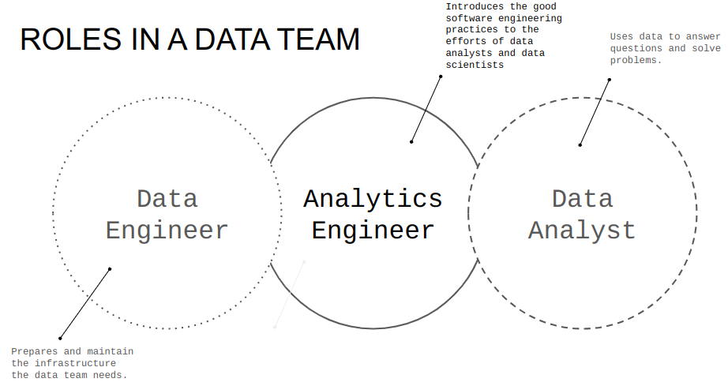

# Module 4 - Analytics engineering

> Course video sources: videos `4.x.x` from the [DE Zoomcamp playlist](https://www.youtube.com/watch?v=uF76d5EmdtU&list=PL3MmuxUbc_hJed7dXYoJw8DoCuVHhGEQb).  
> Other resources: [Slides](./analytics_engineering_slides.pdf).

## Table of contents

* [Prerequisites](#prerequisites).
* [Analytics engineering basics](#analytics-engineering-basics).
    + What is analytics engineering?
    + Data modeling concepts.
        - ETL vs ELT.
        - Kimball's dimensional modeling.
* [What is dbt?](#what-is-dbt).
    + How does dbt work?
    + How to use dbt?
* [Setting up dbt](#setting-up-dbt).
* [Starting a dbt project with BigQuery and dbt Cloud](#starting-a-dbt-project-with-bigquery-and-dbt-cloud).
* .
* .
* .
* .
* [Advanced concepts](#advanced-concepts).
* [Useful links](#useful-links).

## Prerequisites

By this stage of the course you should have already: 

- A running warehouse (BigQuery or Postgres).
- A set of running pipelines ingesting the project dataset (week 3 completed).
- The following datasets ingested from the course [Datasets list](https://github.com/DataTalksClub/nyc-tlc-data/): 
  * Yellow taxi data - Years 2019 and 2020.
  * Green taxi data - Years 2019 and 2020.
  * fhv data - Year 2019. 

## Analytics engineering basics

### What is analytics engineering?

Across the years, there has been a series of data domain developments that have changed they way we work with data:
1. Massively parallel processing (MPP) databases.
2. Data-pipelines-as-a-service.
3. SQL - first.
4. Version control systems.
5. Self-service analytics.
6. Data governance.

The analytics engineer role tries to fill the gap between the data engineer and the data scientist/analyst. It introduces the good software engineering practices to the efforts of data analysts and data scientists. 

Some of the tools that the analytics engineer may be exposed to are:
* Data loading ([Fivetran](https://www.fivetran.com/), [Stitch](https://www.stitchdata.com/), [Airbyte](https://airbyte.com/), [dlt](https://dlthub.com/), [Meltano](https://meltano.com/)).
* Data storing (Data Warehouses, such as [Snowflake](https://www.snowflake.com/en/), [BigQuery](https://cloud.google.com/bigquery), [Redshift](https://aws.amazon.com/redshift/)).
* Data modeling ([dbt](https://www.getdbt.com/), [SQLMesh](https://sqlmesh.com/), [Dataform](https://dataform.co/)).
* Data presentation (BI tools like [Looker](https://www.looker.com/), [Tableau](https://www.tableau.com/), [Metabase](https://www.metabase.com/), [Apache Superset](https://superset.apache.org/)).

In this lesson we will focus on the last two parts: data modeling and data presentation.

### Data modeling concepts

#### ETL vs ELT

* ETL approach takes longer to implement, since we first have to transform the data. But this also mean that we're going to have more stable and compliant data, because it's clean.
* ELT is faster and more flexible, because when we apply the transformation we already have the data loaded. This is also taking advantage of the cloud data warehousing that lowered the costs of storage and compute. We can afford loading all of our data and then transform it in the same data warehouse.

Here we will dive more in the transformation step of the ELT.

#### Kimball's dimensional modeling

Objective:
* Deliver data understandable to the business users.
* Deliver fast query performance.

Approach: prioritise user understandability and query performance over normalization / non-redundant data (3NF).  

Other approaches:
* Bill Inmon.
* Data vault.

**Elements of dimensional modeling**  
* Fact tables.
    * Measurements, metrics or facts.
    * Corresponds to a business process.
    * "Verbs".
* Dimension tables.
    * Corresponds to a business entity.
    * Provides context to a business process.
    * "Nouns".

They can be organised in a star schema or in a snowflake schema ([Link](https://www.geeksforgeeks.org/difference-between-star-schema-and-snowflake-schema/)).

**Architecture of dimensional modeling**
* Stage area.
    * Contains the raw data.
    * Not meant to be exposed to everyone.
* Processing area.
    * From raw data to data models.
    * Focuses in efficiency.
    * Ensuring standards.
* Presentation area.
    * Final presentation of the data.
    * Exposure to business stakeholder.

## What is dbt?

[dbt](https://www.getdbt.com/) stands for ***data build tool***, and is a transformation tool that allows anyone that knows SQL to deploy analytics code following software engineering best practices like modularity, portability, CI/CD, and documentation.

After we extract and load the raw data into our Data Warehouse, we need to transform this data to later expose it to our stakehoulders and be able to perform analysis. dbt helps us transform our data in the DW, but it also introduces good software practices by defining a development workflow (develop / test / deploy).

### How does dbt work?

* In our DW we have our raw data.
* dbt adds a modeling layer, where data is transformed (_derived model_).
* The model with the transformed data is then stored in the Data Warehouse for persistance.
* Each model is:
    * An SQL file.
    * With a SELECT statement, no DDL or DML.
    * A file that dbt will compile and run in our DW.

### How to use dbt?

Two main ways:
* **dbt Core**.
    * Open-source project that allows data transformations.
    * Builds and runs a dbt project (SQL and YAML files).
    * Includes SQL compilation logic, macros and database adapters.
    * Includes a CLI to run dbt commands locally.
    * Open source and free to use.

* **dbt Cloud**.
    * SaaS application to develop and manage dbt projects.
    * Runs dbt Core.
    * Web-based IDE to develop, run and test a dbt project.
    * Includes a scheduler for workflow orchestration.
    * Logging and alerting.
    * Integrated documentation.
    * Free for individuals (one developer seat).

We can take one of the two ways below to follow the dbt lessons:
* With BigQuery (cloud):
    * Development using cloud IDE.
    * No local installation of dbt Core (all will be done in the cloud).
* With Postgres (local):
    * Development using a local IDE of our choice.
    * Local installation of dbt Core connecting to the Postgres database.
    * Run dbt models through the CLI.

## Setting up dbt

> [!NOTE]  
>  the *cloud* setup is the preferred option.
>
> the *local* setup does not require a cloud database.

| Alternative A | Alternative B |
---|---|
| Setting up dbt for using BigQuery (cloud) | Setting up dbt for using Postgres locally  |
|- Open a free developer dbt cloud account following [this link](https://www.getdbt.com/signup/)|- Open a free developer dbt cloud account following [this link](https://www.getdbt.com/signup/)   |
| - [Follow these instructions to connect to your BigQuery instance](https://docs.getdbt.com/guides/bigquery?step=4) | - Follow the [official dbt documentation](https://docs.getdbt.com/docs/core/installation-overview) or  - follow the [dbt core with BigQuery on Docker](docker_setup/README.md) guide to setup dbt locally on docker or  - use a docker image from oficial [Install with Docker](https://docs.getdbt.com/docs/core/docker-install). |
| | - You will need to install the latest version with the BigQuery adapter (dbt-bigquery).|
| | - You will need to install the latest version with the postgres adapter (dbt-postgres).|
| | After local installation you will have to set up the connection to PG in the `profiles.yml`, you can find the templates [here](https://docs.getdbt.com/docs/core/connect-data-platform/postgres-setup) |

In my case, for this course, I choose the **cloud** setup.
* My credentials JSON file for the service account has been saved as `/home/sgrodriguez/.google/credentials/google_dbt_credentials.json`.
* For the project name, I choose the same as in Google Cloud: `dataeng-zoomcamp`.

## Starting a dbt project with BigQuery and dbt Cloud

[Documentation - dbt projects](https://docs.getdbt.com/docs/build/projects).

Before we begin, we create in BigQuery two new empty datasets: one for the models during development phase, and another one for the deployment/production environment. We name them as _dbt_development_ and _dbt_deployment_.

We make sure that to set up a GitHub repo for our project. In Account settings > Projects we can select our project and change its settings, such as Name or dbt Project Subdirectory, which can be convenient if our repo is previously populated and would like to keep the dbt project in a single subfolder.

In order to initialize a dbt project, in the dbt console main page, we create a new branch (since _main_ is _read-only_) and then click on _Initialize dbt project_.

## Advanced concepts

* [Make a model Incremental](https://docs.getdbt.com/docs/build/incremental-models).
* [Use of tags](https://docs.getdbt.com/reference/resource-configs/tags).
* [Hooks](https://docs.getdbt.com/docs/build/hooks-operations).
* [Analysis](https://docs.getdbt.com/docs/build/analyses).
* [Snapshots](https://docs.getdbt.com/docs/build/snapshots).
* [Exposure](https://docs.getdbt.com/docs/build/exposures).
* [Metrics](https://docs.getdbt.com/docs/build/build-metrics-intro).

 ## Useful links

- [Visualizing data with Metabase course](https://www.metabase.com/learn/visualization/).
- [dbt free courses](https://courses.getdbt.com/collections).