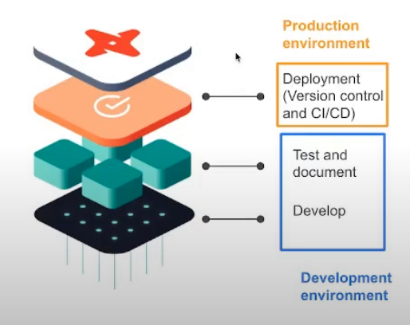

# Module 4 - Analytics engineering

> Course video sources: videos `4.x.x` from the [DE Zoomcamp playlist](https://www.youtube.com/watch?v=uF76d5EmdtU&list=PL3MmuxUbc_hJed7dXYoJw8DoCuVHhGEQb).  
> Other resources:
> * [Slides](./analytics_engineering_slides.pdf).
> * [Álvaro Navas notes](https://github.com/ziritrion/dataeng-zoomcamp/blob/main/notes/4_analytics.md).
> * [Victor Alexandre Padilha notes](https://github.com/padilha/de-zoomcamp/blob/master/week4/README.md).


## Table of contents

* [Prerequisites](#prerequisites).
* [Analytics engineering basics](#analytics-engineering-basics).
    + What is analytics engineering?
    + Data modeling concepts.
        - ETL vs ELT.
        - Kimball's dimensional modeling.
* [What is dbt?](#what-is-dbt).
    + How does dbt work?
    + How to use dbt?
* [Setting up dbt](#setting-up-dbt).
* [Starting a dbt project with BigQuery and dbt Cloud](#starting-a-dbt-project-with-bigquery-and-dbt-cloud).
* [dbt models](#dbt-models).
    + Anatomy of a dbt model.
    + The FROM clause of a dbt model. 
        - Sources and seeds.
        - The ref macro.
    + Defining a source and creating a model.
    + Macros.
    + Packages.
    + Variables.
    + Referencing other models.
* [Testing and documenting dbt models](#testing-and-documenting-dbt-models).
    + Tests.
    + Documentation.
* [Deployment of a dbt project](#deployment-of-a-dbt-project).
    + Deployment using dbt Cloud.
    + Continuous Integration
* []().
* [Advanced concepts](#advanced-concepts).
* [Useful links](#useful-links).


## Prerequisites

By this stage of the course you should have already: 

- A running warehouse (BigQuery or Postgres).
- A set of running pipelines ingesting the project dataset (week 3 completed).
- The following datasets ingested from the course [Datasets list](https://github.com/DataTalksClub/nyc-tlc-data/): 
  * Yellow taxi data - Years 2019 and 2020.
  * Green taxi data - Years 2019 and 2020.
  * fhv data - Year 2019. 


## Analytics engineering basics

### What is analytics engineering?

Across the years, there has been a series of data domain developments that have changed they way we work with data:
1. Massively parallel processing (MPP) databases.
2. Data-pipelines-as-a-service.
3. SQL - first.
4. Version control systems.
5. Self-service analytics.
6. Data governance.

The analytics engineer role tries to fill the gap between the data engineer and the data scientist/analyst. It introduces the good software engineering practices to the efforts of data analysts and data scientists. 


Some of the tools that the analytics engineer may be exposed to are:
* Data loading ([Fivetran](https://www.fivetran.com/), [Stitch](https://www.stitchdata.com/), [Airbyte](https://airbyte.com/), [dlt](https://dlthub.com/), [Meltano](https://meltano.com/)).
* Data storing (Data Warehouses, such as [Snowflake](https://www.snowflake.com/en/), [BigQuery](https://cloud.google.com/bigquery), [Redshift](https://aws.amazon.com/redshift/)).
* Data modeling ([dbt](https://www.getdbt.com/), [SQLMesh](https://sqlmesh.com/), [Dataform](https://dataform.co/)).
* Data presentation (BI tools like [Looker](https://www.looker.com/), [Tableau](https://www.tableau.com/), [Metabase](https://www.metabase.com/), [Apache Superset](https://superset.apache.org/)).


In this lesson we will focus on the last two parts: data modeling and data presentation.


### Data modeling concepts

#### ETL vs ELT


* ETL approach takes longer to implement, since we first have to transform the data. But this also mean that we're going to have more stable and compliant data, because it's clean.
* ELT is faster and more flexible, because when we apply the transformation we already have the data loaded. This is also taking advantage of the cloud data warehousing that lowered the costs of storage and compute. We can afford loading all of our data and then transform it in the same data warehouse.

Here we will dive more in the transformation step of the ELT.


#### Kimball's dimensional modeling

Objective:
* Deliver data understandable to the business users.
* Deliver fast query performance.

Approach: prioritise user understandability and query performance over normalization / non-redundant data (3NF).  

Other approaches:
* Bill Inmon.
* Data vault.


**Elements of dimensional modeling**  
* Fact tables.
    * Measurements, metrics or facts.
    * Corresponds to a business process.
    * "Verbs".
* Dimension tables.
    * Corresponds to a business entity.
    * Provides context to a business process.
    * "Nouns".

They can be organised in a star schema or in a snowflake schema ([Link](https://www.geeksforgeeks.org/difference-between-star-schema-and-snowflake-schema/)).


**Architecture of dimensional modeling**
* Stage area.
    * Contains the raw data.
    * Not meant to be exposed to everyone.
* Processing area.
    * From raw data to data models.
    * Focuses in efficiency.
    * Ensuring standards.
* Presentation area.
    * Final presentation of the data.
    * Exposure to business stakeholder.


## What is dbt?

[dbt](https://www.getdbt.com/) stands for ***data build tool***, and is a transformation tool that allows anyone that knows SQL to deploy analytics code following software engineering best practices like modularity, portability, CI/CD, and documentation.

After we extract and load the raw data into our Data Warehouse, we need to transform this data to later expose it to our stakehoulders and be able to perform analysis. dbt helps us transform our data in the DW, but it also introduces good software practices by defining a development workflow (develop / test / deploy).


### How does dbt work?

* In our DW we have our raw data.
* dbt adds a modeling layer, where data is transformed (_derived model_).
* The model with the transformed data is then stored in the Data Warehouse for persistance.
* Each model is:
    * An SQL file.
    * With a SELECT statement, no DDL or DML.
    * A file that dbt will compile and run in our DW.


### How to use dbt?

Two main ways:
* **dbt Core**.
    * Open-source project that allows data transformations.
    * Builds and runs a dbt project (SQL and YAML files).
    * Includes SQL compilation logic, macros and database adapters.
    * Includes a CLI to run dbt commands locally.
    * Open source and free to use.

* **dbt Cloud**.
    * SaaS application to develop and manage dbt projects.
    * Runs dbt Core.
    * Web-based IDE to develop, run and test a dbt project.
    * Includes a scheduler for workflow orchestration.
    * Logging and alerting.
    * Integrated documentation.
    * Free for individuals (one developer seat).


We can take one of the two ways below to follow the dbt lessons:
* With BigQuery (cloud):
    * Development using cloud IDE.
    * No local installation of dbt Core (all will be done in the cloud).
* With Postgres (local):
    * Development using a local IDE of our choice.
    * Local installation of dbt Core connecting to the Postgres database.
    * Run dbt models through the CLI.


## Setting up dbt

> [!NOTE]  
>  the *cloud* setup is the preferred option.
>
> the *local* setup does not require a cloud database.

| Alternative A | Alternative B |
---|---|
| Setting up dbt for using BigQuery (cloud) | Setting up dbt for using Postgres locally  |
|- Open a free developer dbt cloud account following [this link](https://www.getdbt.com/signup/)|- Open a free developer dbt cloud account following [this link](https://www.getdbt.com/signup/)<br><br> |
| - [Follow these instructions to connect to your BigQuery instance](https://docs.getdbt.com/guides/bigquery?step=4) | - Follow the [official dbt documentation](https://docs.getdbt.com/docs/core/installation-overview) or <br>- follow the [dbt core with BigQuery on Docker](docker_setup/README.md) guide to setup dbt locally on docker or <br>- use a docker image from oficial [Install with Docker](https://docs.getdbt.com/docs/core/docker-install). |
| | - You will need to install the latest version with the BigQuery adapter (dbt-bigquery).|
| | - You will need to install the latest version with the postgres adapter (dbt-postgres).|
| | After local installation you will have to set up the connection to PG in the `profiles.yml`, you can find the templates [here](https://docs.getdbt.com/docs/core/connect-data-platform/postgres-setup) |


In my case, for this course, I choose the **cloud** setup.
* My credentials JSON file for the service account has been saved as `/home/sgrodriguez/.google/credentials/google_dbt_credentials.json`.
* For the project name, I choose the same as in Google Cloud: `dataeng-zoomcamp`.


## Starting a dbt project with BigQuery and dbt Cloud

[Documentation - dbt projects](https://docs.getdbt.com/docs/build/projects).

First of all, create in BigQuery two new empty datasets: one for the models during development phase, and another one for the deployment/production environment. We name them as _dbt_development_ and _dbt_deployment_.

In the dbt UI we need to set up a new project. In `Account settings` > `Projects` we can select our project and change its settings, such as Name or dbt Project Subdirectory, which can be convenient if our repo is previously populated and would like to keep the dbt project in a single subfolder. Below are the configuration values chosen for the course:
* Project name: _dataeng-zoomcamp_.
* Project subdirectory: _04_analytics_engineering/taxi_rides_ny_.
* BigQuery connection: upload the service account JSON file.
* Development credentials: Dataset _dbt_development_.
* Set up a repository: connect with our GitHub repo.

In order to initialize a dbt project, in the dbt console main page, create a new branch (since _main_ is _read-only_) and then click on `Initialize dbt project` (equivalent tu run `dbt init` in the terminal, more info on this command [here](https://docs.getdbt.com/reference/commands/init)).

After that, several folders and files will be created under the specified project subdirectory.

Inside **`dbt_project.yml`**, modify the project name and the models name, for example to `taxi_rides_ny`, and delete the rest of the lines under `models` section.

Finally, commit and sync the changes.


## dbt models


### Anatomy of a dbt model

In the traditional approach to data modeling each consumer of data would rebuild their own data transformations from raw source data. We could call this a _monolithic_ approach.

dbt promotes using a [**modular data modeling approach**](https://www.getdbt.com/analytics-engineering/modular-data-modeling-technique#what-is-modular-data-modeling) instead. With a modular approach, every producer or consumer of data models in an organization could start from the foundational data modeling work that others have done before them, rather than starting from source data every time.


dbt models are mostly written in SQL (a dbt model is essentially a `SELECT` query) but they also make use of the [Jinja templating language](https://jinja.palletsprojects.com/en/latest/) for templates.

An example dbt model would be the one below.

```sql
{{
    config(materialized='table')
}}

SELECT *
FROM staging.source_table
WHERE record_state = 'ACTIVE'
```

* In the Jinja statement defined within the `{{ }}` block we call the [`config()` function](https://docs.getdbt.com/reference/dbt-jinja-functions/config).
    * More info about Jinja macros for dbt [in this link](https://docs.getdbt.com/docs/build/jinja-macros).
* We commonly use the `config()` function at the beginning of a model to define a [**materialization strategy**](https://docs.getdbt.com/docs/build/materializations): a strategy for persisting dbt models in a warehouse.
    * The `ephemeral` strategy creates something similar to a [Common Table Expression](https://www.essentialsql.com/introduction-common-table-expressions-ctes/) (CTE). Ephemeral materializations are not stored in any physical storage, they are temporary and exist only for the duration of a single dbt run.
    * The `view` strategy rebuilds the model on each run as a SQL view. Views are virtual tables created by dbt that can be queried like regular tables.
    * The `table` strategy means that the model will be rebuilt as a table on each run. Tables are physical representations of data that are created and stored in the database.
    * The `incremental` strategy is essentially a `table` strategy but it allows us to add or update records incrementally rather than rebuilding the complete table on each run. Incremental materializations are a powerful feature of dbt that allow for efficient updates to existing tables, reducing the need for full data refreshes.
    * You can also configure custom materializations for advanced cases.

dbt will compile this code into the following SQL query:

```sql
CREATE TABLE my_schema.my_model AS (
    SELECT *
    FROM staging.source_table
    WHERE record_state = 'ACTIVE'
)
```

After the code is compiled, dbt will run the compiled code in the Data Warehouse.


Additional model properties are stored in YAML files. Traditionally, these files were named `schema.yml` but later versions of dbt do not enforce this as it could lead to confusion.

In the case of our project, the modular data modeling will look like in the image below:


### The FROM clause of a dbt model

#### Sources and seeds

The `FROM` clause within a `SELECT` statement defines the _sources_ of the data to be used.

The following sources are available to dbt models:

* **Sources**: The data loaded within our Data Warehouse.
    * We can access this data with the `source()` function.
    * The `sources` key in our YAML file contains the details of the databases that the `source()` function can access and translate into proper SQL-valid names.
        * Additionally, we can define "source freshness" to each source so that we can check whether a source is "fresh" or "stale", which can be useful to check whether our data pipelines are working properly.
    * More info about sources [in this link](https://docs.getdbt.com/docs/build/sources).
* **Seeds**: CSV files which can be stored in our repo under the `seeds` folder.
    * The repo gives us version controlling along with all of its benefits.
    * Seeds are best suited to static data which changes infrequently.
    * Seed usage:
        1. Add a CSV file to your `seeds` folder.
        1. Run the [`dbt seed` command](https://docs.getdbt.com/reference/commands/seed) to create a table in our Data Warehouse.
            * If you update the content of a seed, running `dbt seed` will append the updated values to the table rather than substituing them. Running `dbt seed --full-refresh` instead will drop the old table and create a new one.
        1. Refer to the seed in your model with the `ref()` function.
    * More info about seeds [in this link](https://docs.getdbt.com/docs/build/seeds).

Here's an example of how you would declare a source in a `.yml` file:

```yaml
sources:
    - name: staging
      database: production
      schema: ny_taxi

      loaded_at_field: record_loaded_at
      tables:
        - name: green_taxi_data
        - name: yellow_taxi_data
          freshness:
            error_after: {count: 6, period: hour}
```

And here's how you would reference a source in a `FROM` clause:

```sql
FROM {{ source('staging','yellow_taxi_data') }}
```
* The first argument of the `source()` function is the source name, and the second is the table name.

In the case of seeds, assuming you've got a `taxi_zone_lookup.csv` file in your `seeds` folder which contains `locationid`, `borough`, `zone` and `service_zone`:

```sql
SELECT
    locationid,
    borough,
    zone,
    replace(service_zone, 'Boro', 'Green') as service_zone
FROM {{ ref('taxi_zone_lookup') }}
```


#### The ref macro

The `ref()` function references underlying tables and views in the Data Warehouse. When compiled, it will automatically build the dependencies and resolve the correct schema fo us. So, if BigQuery contains a schema/dataset called `dbt_dev` inside the `my_project` database which we're using for development and it contains a table called `stg_green_taxi_data`, then the following code...

```sql
WITH green_data AS (
    SELECT *,
        'Green' AS service_type
    FROM {{ ref('stg_green_taxi_data') }}
),
```

...will compile to this:

```sql
WITH green_data AS (
    SELECT *,
        'Green' AS service_type
    FROM "my_project"."dbt_dev"."stg_green_taxi_data"
),
```
* The `ref()` function translates our references table into the full reference, using the `database.schema.table` structure.
* If we were to run this code in our production environment, dbt would automatically resolve the reference to make it point to our production schema.


### Defining a source and creating a model

Let's now create our first model.

Create a new folder under `models` directory and name it as `staging`. This will be our initial layer, which will have the models that clean the source data.

Under `staging` create a `schema.yml` file and define the sources.

```yaml
# schema.yml
version: 2

sources:
    - name: staging
      database: <your_project>
      schema: ny_taxi

      tables:
          - name: green_taxi_data
          - name: yellow_taxi_data
```


Create another file under `staging` directory, and name it as `stg_green_taxi_data.sql`.

```sql
-- stg_green_taxi_data.sql
{{ config(materialized='view') }}

select * from {{ source('staging', 'green_taxi_data') }}
limit 100
```
* This query will create a ***view*** in the `staging` dataset/schema in our database.
* We make use of the `source()` function to access the green taxi data table, which is defined inside the `schema.yml` file.

The advantage of having the properties in a separate file is that we can easily modify the `schema.yml` file to change the database details and write to different databases without having to modify our `stg_green_taxi_data.sql` file.

You may know run the model with the `dbt run` command, either locally or from dbt Cloud. You can also execute `dbt build` to try to build the project. This will fail by now (because of predefined tests), but it doesn't matter.


### Macros

[Macros](https://docs.getdbt.com/docs/build/jinja-macros) are pieces of code in Jinja that can be reused, similar to functions in other languages.

dbt already includes a series of macros like `config()`, `source()` and `ref()`, but custom macros can also be defined.

Macros allow us to add features to SQL that aren't otherwise available, such as:
* Use control structures such as `if` statements or `for` loops.
* Use environment variables in our dbt project for production.
* Operate on the results of one query to generate another query.
* Abstract snippets of SQL into reusable macros.

Macros are defined in separate `.sql` files which are typically stored in a `macros` directory.

There are 3 kinds of Jinja _delimiters_:
* `` for ***statements*** (control blocks, macro definitions)
* `{{ ... }}` for ***expressions*** (literals, math, comparisons, logic, macro calls...)
* `{# ... #}` for comments.

Here's a macro definition example:

```sql
{# This macro returns the description of the payment_type #}



    case {{ payment_type }}
        when 1 then 'Credit card'
        when 2 then 'Cash'
        when 3 then 'No charge'
        when 4 then 'Dispute'
        when 5 then 'Unknown'
        when 6 then 'Voided trip'
    end


```
* The `macro` keyword states that the line is a macro definition. It includes the name of the macro as well as the parameters.
* The code of the macro itself goes between 2 statement delimiters. The second statement delimiter contains an `endmacro` keyword.
* In the code, we can access the macro parameters using expression delimiters.
* The macro returns the code we've defined rather than a specific value.

Here's how we use the macro:
```sql
select
    {{ get_payment_type_description('payment_type') }} as payment_type_description,
    -- congestion_surcharge
    cast(congestion_surcharge as numeric) as congestion_surcharge
from {{ source('staging','green_taxi_data') }}
where vendor_id is not null
limit 100
```
* We pass a `payment_type` variable which may be an integer from 1 to 6.

And this is what it would compile to:
```sql
select
    case payment_type
        when 1 then 'Credit card'
        when 2 then 'Cash'
        when 3 then 'No charge'
        when 4 then 'Dispute'
        when 5 then 'Unknown'
        when 6 then 'Voided trip'
    end as payment_type_description,
    cast(congestion_surcharge as numeric) as congestion_surcharge
from {{ source('staging','green_taxi_data') }}
where vendor_id is not null
```
* The macro is replaced by the code contained within the macro definition as well as any variables that we may have passed to the macro parameters.


### Packages

Packages act like libraries in other programming languages. Packages are standalone dbt projects that define models and macros for specific types of problems. So, when you add a package to your project, the package's models and macros become part of your own project. A list of useful packages can be found in the [dbt package hub](https://hub.getdbt.com/).

Packages are imported using a `packages.yml` file in the root directory of our project. In our example, we are going to use the `dbt-labs/dbt_utils` package ([GitHub repo](https://github.com/dbt-labs/dbt-utils)), which is one of the most used packages.

```yml
packages:
  - package: dbt-labs/dbt_utils
    version: 1.1.1
```

After declaring your packages, you need to run the `dbt deps` command, which downloads and installs the package dependencies for your project.

You may access macros inside a package in a similar way to how Python access class methods. For example, you can create a [surrogate key](https://docs.getdbt.com/terms/surrogate-key) based on `vendor_id` and `lpep_pickup_datetime` in our model in this way:

```sql
select
    {{ dbt_utils.generate_surrogate_key(['vendor_id', 'lpep_pickup_datetime']) }} as trip_id,
    -- ...
```


### Variables

Variables are useful for defining values that should be used across the project, like in other programming languages. With a macro, dbt allows us to provide data to models for compilation.

Variables can be defined in 2 different ways:
* Under the `vars` keyword inside `dbt_project.yml`.
    ```yml
    vars:
        payment_type_values: [1, 2, 3, 4, 5, 6]
    ```
* As arguments when building or running your project.
    ```sh
    dbt build --select <model.sql> --vars '{"is_test_run": false}'
    ```

Variables can be used with the `var()` macro. For example:
```sql


    limit 100


```
* In this case, the default value for `is_test_run` is `true`; in the absence of a variable definition either on the `dbt_project.yml` file or when running the project, then `is_test_run` would be `true`.
* As we saw in the second way, we can pass the value `false` when runnning `dbt build`. Then the `if` statement would evaluate to `false` and the code within would not run.


### Referencing other models

The models we've created in the _staging area_ are for normalizing the fields of both green and yellow taxis. With normalized field names we can now join the 2 together in more complex ways.

The `ref()` macro is used for referencing any undedrlying tables and views that we've created, so we can reference seeds as well as models using this macro, as we do in the `dim_zones.sql` under `models/core` directory. The model below references the `taxi_zone_lookup` table created from the taxi zone lookup CSV seed.

```sql
{{ config(materialized='table') }}

select
    locationid,
    borough,
    zone,
    replace(service_zone, 'Boro', 'Green') as service_zone
from {{ ref('taxi_zone_lookup') }}
```


Finally, we create our fact table, `fact_trips.sql`, where we put all our tables together (yellow, green and zones). The snippet below references the `stg_green_taxi_data` model that we've created before. Since a model outputs a table/view, we can use it in the `FROM` clause of any query.


```sql
with green_data as (
    select *, 
        'Green' as service_type 
    from {{ ref('stg_green_taxi_data') }}
), 
```

> [!NOTE]  
> Running `dbt run` will run all models but NOT the seeds. The `dbt build` can be used instead to run all seeds and models as well as tests, which we will cover later. Additionally, running `dbt run --select my_model` will only run the model itself, but running `dbt run --select +my_model` will run the model as well as all of its dependencies.


## Testing and documenting dbt models

Testing and documenting are not required steps to successfully run models, but they are expected in any professional setting.


### Tests

Tests are assumptions that we make about our data.

In dbt, tests are essentially a `SELECT` query that will return the amount of records that fail because they do not follow the assumption defined by the test.

Tests are defined on a column in the model YAML files (like the `schema.yml` file we defined before).

dbt provides a few predefined tests to check if the column values are: unique, not null, accepted values, or a foreign key to another table; but you can create your own custom tests as queries, and use tests provided by dbt packages.

Here's an example test:

```yml
models:
  - name: stg_yellow_taxi_data
    description: >
        Trips made by New York City's iconic yellow taxis. 
    columns:
        - name: trip_id
        description: Primary key for this table, generated with a concatenation of vendor_id+pickup_datetime
        tests:
            - unique:
                severity: warn
            - not_null:
                severrity: warn
```
* The tests are defined for a column in a specific table for a specific model.
* There are 2 tests in this YAML file: `unique` and `not_null`. Both are predefined by dbt.
* `unique` checks whether all the values in the `trip_id` column are unique.
* `not_null` checks whether all the values in the `trip_id` column are not null.
* The severity can be either `warn` or `error`. In this example, both tests will return a warning in the command line interface if they detect an error.

You can run all tests with the `dbt test` command, or you can select a particular model through `dbt test --select <model_name>`.


### Documentation

dbt provides a way to generate documentation for your dbt project and render it as a website.

You may have noticed in the previous code block that a `description:` field can be added to the YAML file. dbt will make use of these fields to gather info.

The dbt generated docs will include the following:
* Information about your project.
    * Model code (both from the .sql files and compiled code).
    * Model dependencies.
    * Sources.
    * Auto generated DAGs from the `ref()` and `source()` macros.
    * Descriptions from the .yml files and tests.
* Information about the Data Warehouse (`information_schema`).
    * Column names and data types
    * Table stats like size and rows

dbt docs can be generated on the cloud or locally with `dbt docs generate`, and can be hosted in dbt Cloud as well or on any other webserver with `dbt docs serve`.


## Deployment of a dbt project

Deployment is the process of running the models we created in our development environment in a production environment. Separating the development and production environments allows us to continue building models and testing them without affecting our production environment.




Normally, a production environment will have a different schema in our Data Warehouse and ideally a different user.

The **deployment workflow** defines the steps used to create a model from scratch and bring it to production. Here's a deployment workflow example:
1. Develop in a user branch.
1. Open a PR to merge into the main branch.
1. Merge the user branch to the main branch.
1. Run the new models in the production environment using the main branch.
1. Schedule the models.

dbt projects are usually deployed in the form of **jobs**.
* A job is a collection of commands such as `build` or `test`. A job can contain multiple commands.
* Jobs can be triggered manually or on schedule.
    * dbt Cloud has a scheduler which can run jobs for us, but other tools such as Airflow or cron can be used as well.
* Each job will keep a log of the runs over time, and each run will keep the logs for each command.
* A job may also be used to generate documentation, which may be viewed under the run information.
* If the `dbt source freshness` command was run, the results can also be viewed at the end of a job.


### Deployment using dbt Cloud

In dbt Cloud, you might have noticed that after the first commit, the `main` branch becomes read-only and forces us to create a new branch if we want to keep developing. dbt Cloud does this to enforce us to open PRs for CI purposes (see [Continuous Integration](#continuous-integration)) rather than allowing merging to `main` straight away.

In order to properly establish a deployment workflow, we must define **environments** within dbt Cloud. In the top bar, under _Environments_, you will see that a default _Development_ environment is already generated, which is the one we've been using so far.

We will create a new _Production_ environment of type _Deployment_ using the latest stable dbt version (`v1.7` at the time of writing these notes). By default, the environment will use the `main` branch of the repo but you may change it for more complex workflows. For this example, we will use the `dbt_deployment` dataset (make sure that this dataset/schema exists in your BigQuery project).

Once we have our environment, we can create jobs. For the example, create a new deploy job with name `Nightly` inside the _Production_ environment. You can add a description as well. 
* In _Execution settings_ section, indicate the command/s to run (in this example, `dbt build`). Check the _Generate docs on run_ and _Run source freshness_ options.
* In _Schedule_ section, select _Run on schedule_ and establish a schedule of your choice.
* There are also some advance settings, that we leave by default for now.
* Save the job.


The jobs can be run in 3 different ways:
* Following the schedule we have set.
* Manually by clicking on the _Run now_ button in the job view.
* Via an API (check `API trigger`), for example, when using an orchestrator.


When a job is running, you can check the current state of it as well as the logs. After the run is finished, you will see a _View Documentation_ button at the top; clicking on it will open a new browser window/tab with the generated docs. If you want to have it also visible under _Documentation_ in the top menu, you can edit it via _Account settings_ > _Projects_. Once there, under _Artifacts_, you can choose the job you want to take the documentation (and source freshness) from.


### Continuous Integration

Another good software engineering practice that dbt enables is **Continuous Integration** (CI): the practice of regularly merging development branches into a central repository. Ideally, these merging processes also include automated builds and tests. The goal of CI is to reduce adding bugs to the production code and maintain a more stable project.

CI is built on jobs: a CI job will do things such as build, test, etc. We can define CI jobs which can then be triggered under certain circunstances to enable CI.

dbt makes use of GitHub/GitLab's Pull Requests to enable CI via [webhooks](https://www.wikiwand.com/en/Webhook). When a PR is ready to be merged, a webhook is received in dbt Cloud that will enqueue a new run of a CI job. This run will usually be against a temporary schema that has been created explicitly for the PR. If the job finishes successfully, the PR can be merged into the main branch, but if it fails the merge will not happen.

CI jobs can also be scheduled with the dbt Cloud scheduler, Airflow, cron and a number of additional tools.


## Advanced concepts

* [Make a model Incremental](https://docs.getdbt.com/docs/build/incremental-models).
* [Use of tags](https://docs.getdbt.com/reference/resource-configs/tags).
* [Hooks](https://docs.getdbt.com/docs/build/hooks-operations).
* [Analysis](https://docs.getdbt.com/docs/build/analyses).
* [Snapshots](https://docs.getdbt.com/docs/build/snapshots).
* [Exposure](https://docs.getdbt.com/docs/build/exposures).
* [Metrics](https://docs.getdbt.com/docs/build/build-metrics-intro).


 ## Useful links

- [Visualizing data with Metabase course](https://www.metabase.com/learn/visualization/).
- [dbt free courses](https://courses.getdbt.com/collections).