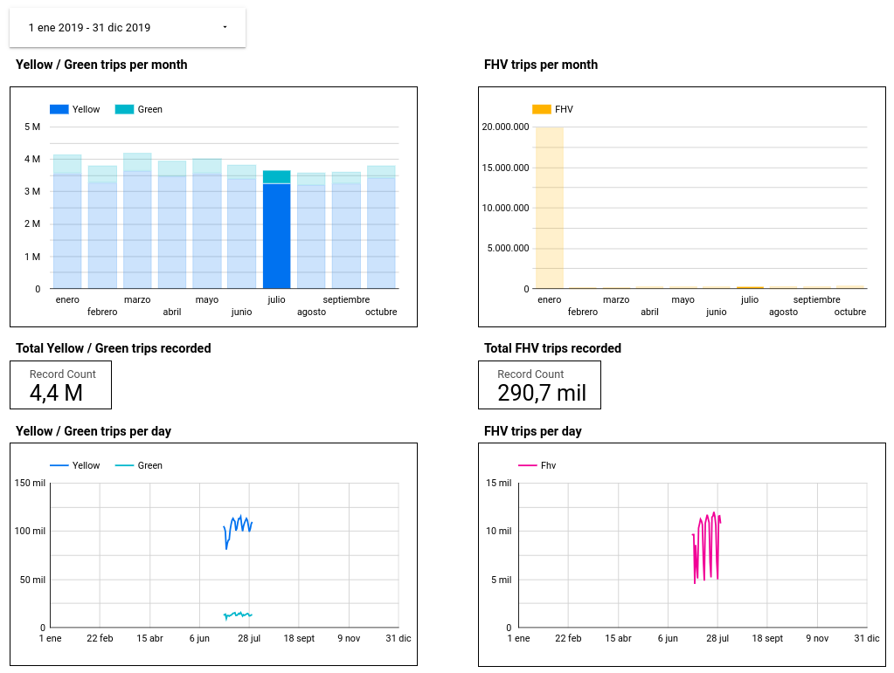

# Module 4 Homework Solutions

## Setup

Under the `taxi_rides_ny/models` directory, we add a new folder, `homework`, where we will create the files we need: `schema.yml`, `stg_fhv_data.sql`, and `fact_fhv_trips.sql`.

`schema.yml` file, **first version**:

```yml
version: 2

sources:
  - name: staging
    database: warm-rock-411419
    schema: ny_taxi
    tables:
      - name: fhv_taxi_data
```

In `stg_fhv_data.sql` we write the following script:

```sql
{{
    config(
        materialized='view'
    )
}}

select
    dispatching_base_num,

    -- identifiers
    cast(pu_location_id as integer) as  pu_location_id,
    cast(do_location_id as integer) as do_location_id,

    -- timestamps
    cast(pickup_datetime as timestamp) as pickup_datetime,
    cast(dropoff_datetime as timestamp) as dropoff_datetime,

    -- trip info
    sr_flag
from {{ source('staging', 'fhv_taxi_data') }}
where extract(year from pickup_datetime) = 2019

-- dbt build --select <model.sql> --vars '{"is_test_run": false}'


  limit 100


```


Similar to the fact trips file used for Yellow and Green Taxi data, our `fact_fhv_trips.sql` file looks like below.
```sql
{{
    config(
        materialized='table'
    )
}}

with fhv_data as (
    select *,
            'Fhv' as service_type
    from {{ ref('stg_fhv_data') }}
),

dim_zones as (
    select * from {{ ref('dim_zones') }}
    where borough != 'Unknown'
)

select
    fhv_data.dispatching_base_num,
    fhv_data.service_type,
    fhv_data.pu_location_id,
    pickup_zone.borough as pickup_borough,
    pickup_zone.zone as pickup_zone,
    dropoff_zone.borough as dropoff_borough,
    dropoff_zone.zone as dropoff_zone,
    fhv_data.pickup_datetime,
    fhv_data.dropoff_datetime,
    fhv_data.sr_flag
from fhv_data
inner join dim_zones as pickup_zone
on fhv_data.pu_location_id = pickup_zone.locationid
inner join dim_zones as dropoff_zone
on fhv_data.do_location_id = dropoff_zone.locationid
```


Finally, we make use of the `generate_model_yaml` macro from the `dbt-codegen` package by compiling the following code, and copy the results into our `schema.yml` file, adding the `models` section to the file (where we already had `sources` section).
```sql

{{ codegen.generate_model_yaml(
    model_names = models_to_generate
) }}
```

Once we have successfully built our models, we can start querying them via BigQuery.

The total count of records I have in `stg_fhv_data` is 43,261,276.


## Questions

### Question 1

**Question:** What happens when we execute dbt build --vars '{"is_test_run": true}'?

**Answer:** It's the same as running *dbt build*.  

Since the default option for `is_test_run` is already `true` in our `stg_fhv_data` model, the command will do the same as if we just run `dbt build`. Note that, in my case, when I run this I got 100 records with null values for both `pu_location_id` and `do_location_id`, so it ended up with no records in our `fact_fhv_trips` table. In order to have all the records we have to run the command `dbt build --select +fact_fhv_trips --vars '{"is_test_run": false}'`.


### Question 2

**Question:** What is the code that our CI job will run?

**Answer:** The code from a development branch requesting a merge to main.


### Question 3

**Question:** What is the count of records in the model fact_fhv_trips after running all dependencies with the test run variable disabled (:false)?

**Answer:** I got **23,014,060**. The closest answer from the options given is **22,998,722**.

SQL query:
```sql
SELECT count(1) FROM `<project ID>.dbt_deployment.fact_fhv_trips`;
```


### Question 4

**Question:** What is the service that had the most rides during the month of July 2019 month with the biggest amount of rides after building a tile for the fact_fhv_trips table?

**Answer:** Yellow.

I got the following number of records by service type in July 2019:
* Yellow Taxi: 3,251,006.
* Green Taxi: 415,417.
* FHV: 290,682.


The dashboard created can be found [here](./homework_dashboard.pdf).

The same dashboard, but in this case filtered for the month of July 2019, is shown below.



