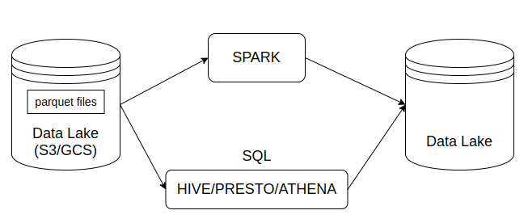
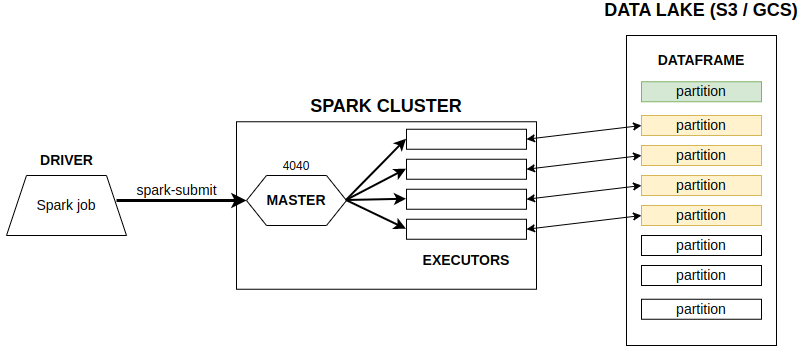
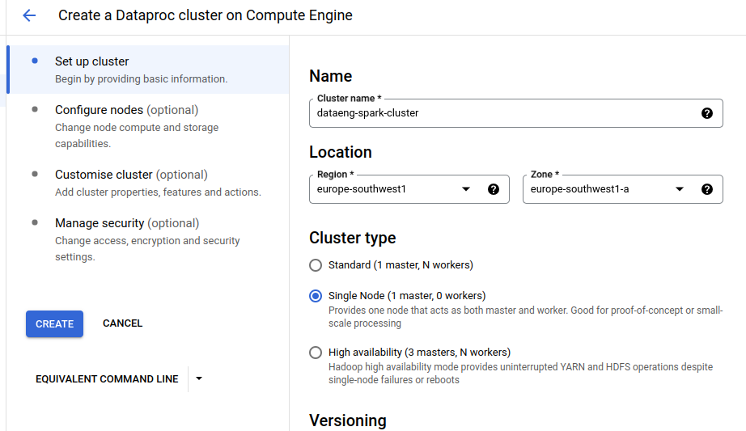
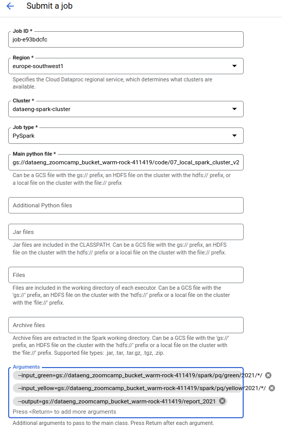

# Module 5 - Batch processing

> Course video sources: videos `5.x.x` from the [DE Zoomcamp playlist](https://www.youtube.com/watch?v=dcHe5Fl3MF8&list=PL3MmuxUbc_hJed7dXYoJw8DoCuVHhGEQb).


## Table of contents

* [Prerequisites](#prerequisites).
* [Introduction to batch processing](#introduction-to-batch-processing).
* [Introduction to Spark](#introduction-to-spark).
* [Installing Spark on Linux](#installing-spark-on-linux).
* [First look at Spark / PySpark](#first-look-at-spark--pyspark).
* [Spark DataFrames](#spark-dataframes).
* [SQL with Spark](#sql-with-spark).
* [Spark internals](#spark-internals).
    + Anatomy of a Spark cluster.
    + GroupBy in Spark.
    + Joins in Spark.
* [Resilient Distributed Datasets (RDDs)](#resilient-distributed-datasets-rdds).
* [Running Spark in the Cloud](#running-spark-in-the-cloud).
    + Connecting to Google Cloud Storage.
        - Uploading data to GCS.
        - Connecting Spark jobs to GCS.
    + Creating a standalone local Spark cluster.
        - Creating a cluster.
        - Turning the notebook into a script.
        - Using spark-submit for submitting jobs.
    + Setting up a Dataproc cluster.
        - Creating a cluster in GCP.
        - Running a Spark job with Dataproc.
        - Submitting the job with the Cloud SDK.
    + Connecting Spark to BigQuery.
* [Module 5 Homework](./homework/).


## Prerequisites

 
For this lesson, we will work with Yellow and Green Taxi Parquet files. In order to have them in the same format than in the videos, follow [these instructions](../extras/convert_csv_to_parquet/README.md) about converting CSV files from DataTalksClub backup to Parquet, from the `extras` directory.


## Introduction to batch processing

Two primary ways of processing data: batch processing and stream processing.
* **Batch processing:** processing chunks of data at regular intervals. Examples of batch jobs: weekly, daily, hourly, ...
* **Stream processing:** processing data on the fly.


**Technologies** for batch processing:
* Python scripts (as we saw in module 1).
  * Can be run in Kubernetes, AWS Batch, etc.
* SQL (like dbt models that we saw in module 4).
* Spark (we cover it in this module).
* Flink.


**Orchestrating** batch jobs: it is usually done by a data workflow orchestration tool, like **Airflow** or **Mage**. Example of a typical workflow for batch jobs:

```
 csv  -> Python -> SQL (dbt) -> Spark -> Python
(Lake)
```

**Advantages** of batch jobs:
* Easy to manage.
* Retry (not in real time).
* Scale.
* Easier to orchestrate.

**Main disadvantage:**
* Delay, but in many cases we don't need to act that fast.


## Introduction to Spark

[Apache Spark](https://spark.apache.org/) is an open-source unified analytics engine for large-scale data processing.
* The processing happens in Spark (in its machines or executors), that is why it is an **engine**.
* It is **distributed**, so it can be run in _clusters_ with multiple _nodes_, each pulling and transforming data.
* It is **multi-language**, we can use Java, Scala (native way), and in other languages by using wrappers.
    + The Spark wrapper (API) for Python is called [PySpark](https://spark.apache.org/docs/latest/api/python/).
* Spark can deal with both batch and stream processing.


**When to use Spark**  
Typically used when our data (for example, several parquet files) is in a data lake (S3/GCS). So Spark would pull this data, do some processing and then put the data back in the data lake.

If we can express our batch job as SQL, we can make use of tools like Hive, Presto, Trino, or Athena. However, sometimes this is not possible (because we need more flexibility, because we have to apply more complex manipulation -for example, ML models-). In those cases, we should go with Spark.




## Installing Spark on Linux

* [Java setup](./java_setup.md).
* [Spark setup](./spark_setup.md).
* PySpark, included in the [environment.yml](../environment.yml) file.


## First look at Spark / PySpark

We make use of the [01_pyspark_first_steps.ipynb](./code/01_pyspark_first_steps.ipynb) notebook for this lesson, whose main points are:
* Creating a Spark session.
* Reading CSV files.
* Partitions / saving to parquet files.


## Spark DataFrames

Notebook: [02_spark_dataframes.ipynb](./code/02_spark_dataframes.ipynb).
* Actions vs transformations.
* Functions and User Defined Functions (UDFs).


## SQL with Spark

> [!NOTE]  
> Before executing the notebook, copy the directory with all the parquet files from `<project_root>/data/nyc_tlc/pq` to `05_batch_processing/data`.

Notebook: [03_spark_sql.ipynb](./code/03_spark_sql.ipynb).


## Spark internals

### Anatomy of a Spark cluster

So far, we have used a local cluster, where we have everything (master, executors, ...) in one computer. But a Spark cluster can contain multiple computers that work together.

Spark clusters are managed by a **master**, which is their entrypoint and usually has its UI on the port `4040`. When a **driver** submits a Spark job (a driver can be an Airflow DAG, a computer running a local script, etc.), it sends the code to execute to the master, which acts as a cordinator and divides the work among the cluster's **executors** (these are the machines that actually do the computation). If any executor fails and becomes offline for any reason, the master will reassign the task to another executor. Once an executor finishes a task, it takes another one to process, until all the tasks are completed.

Each executor will fetch a dataframe partition stored in a Data Lake (usually S3, GCS or a similar cloud provider), do something with it and then store it somewhere, which could be the same Data Lake or somewhere else. If there are more partitions than executors, executors will keep fetching partitions until every single one has been processed.



This is in contrast to **Hadoop**, another data analytics engine, whose executors locally store the data they process (instead of downloading data on the machine, Hadoop download code on the machine that already has the data). This introduces the concept of **data locality**. Partitions in Hadoop are duplicated across several executors for redundancy, in case an executor fails for whatever reason (Hadoop is meant for clusters made of commodity hardware computers). However, data locality has become less important as storage and data transfer costs have dramatically decreased and nowadays it is feasible to separate storage from computation, so Hadoop has become less popular. 

The prefered way nowadays is to keep the files in the cloud storage provider. So the executors do not keep the data with them, but instead pull data (usually small files or partitions) from the cloud, process it and save the results back in the data lake.


### GroupBy in Spark

Notebook: [04_groupby_and_joins.ipynb](./code/04_groupby_and_joins.ipynb).
* How GroupBy works internally.
* Shuffling / sort merge algorithm.


### Joins in Spark

Notebook (cont.): [04_groupby_and_joins.ipynb](./code/04_groupby_and_joins.ipynb).
* Joining two large tables: sort merge join.
* Joining one large and one small table: broadcasting.


## Resilient Distributed Datasets (RDDs)

Notebook: [05_rdds.ipynb](./code/05_rdds.ipynb).

RDDs simple operations: map and reduce.
* What are RDDs and how are they related to DataFrames.
* From DataFrame to RDD: `rdd`.
* Operations on RDDs: `filter()`, `map()`, `reduceByKey()`.
* From RDD to DataFrame: `toDF()`.

Spark RDD mapPartitions: `mapPartitions()`.


## Running Spark in the Cloud

### Connecting to Google Cloud Storage

Google Cloud Storage is an [cloud object storage service](https://cloud.google.com/learn/what-is-object-storage). Spark can connect to remote object stores by using **connectors**. Each object store has its own connector. If we want to connect our local Spark application to our data lake we need to use the [Cloud Storage connector](https://cloud.google.com/dataproc/docs/concepts/connectors/cloud-storage).


#### Uploading data to GCS

Before doing the connection, we use **`gsutil`** to upload our local parquet files to GCS.

```bash
gsutil -m cp -r <local_path> gs://<gcs_path>
```
* `-m` flag enables multithreading or parallelization to use all the CPUs for uploading.
* `-r` recursive (because we are uploading a directory with multiple folders and files inside).


#### Connecting Spark jobs to GCS

We need to download the Cloud Storage connector for Hadoop, in order for Spark to know how exactly to connect to GCS.
* Create a `lib` folder in the project root directory.
* Download the Cloud Storage connector (a jar file) to the `lib` folder. In this case, we use connector version 2.2.20 for Hadoop 3.

    ```bash
    # inside lib folder
    gsutil cp gs://hadoop-lib/gcs/gcs-connector-hadoop3-2.2.20.jar gcs-connector-hadoop3-2.2.20.jar
    ```
* Configure the connection between Spark and GCS. For that, we follow the instructions from the [`06_spark_gcs.ipynb`](./code/06_spark_gcs.ipynb) notebook.


### Creating a standalone local Spark cluster

#### Creating a cluster

Notebook: [07_local_spark_cluster.ipynb](./code/07_local_spark_cluster.ipynb).

So far, we have created a local cluster by running the following instruction in our notebooks.

```py
spark = SparkSession.builder \
    .master("local[*]") \
    .appName("test") \
    .getOrCreate()
```

When we run it we create a local Spark cluster and then we connect to it. The problem with this approach is that once the notebook kernel is shut down, the cluster will disappear.

We now want to create a **Standalone cluster** that does not depend on the notebook to run. For that we follow the [Spark Standalone Mode instructions](https://spark.apache.org/docs/latest/spark-standalone.html).

We can start a standalone master server by executing:

```sh
$SPARK_HOME/sbin/start-master.sh
```

Once started, we can find on the master's web UI (`localhost:8080` by default) a `spark://HOST:PORT` URL, which we can use to connect workers to it, or pass as the `master` argument to `SparkContext` or `SparkSession`.

```py
spark = SparkSession.builder \
    .master("spark://<HOST>:7077") \
    .appName("test") \
    .getOrCreate()
```

* Note that we used the HTTP port 8080 for browsing to the dashboard but we use the Spark port 7077 for connecting our code to the cluster.

At this point, if we want to execute a Spark job we get an error, since we do not have any worker running. Similarly to what we previously did, we can start one or more workers and connect them to the master via:

```bash
$SPARK_HOME/sbin/start-worker.sh <master-spark-URL>
```

We can verify on the Spark UI that there is one active worker and we can execute jobs.


#### Turning the notebook into a script

We convert our `07_local_spark_cluster.ipynb` notebook into the [local_spark_cluster.py](./code/local_spark_cluster.py) script. In addition, this script has been made configurable parametrized to accept parametrized inputs and output, so that we do not have to hardcode some of the values.

We run it passing input data from 2020 (make sure to have killed the application started from the notebook, since by default it takes all the cores available, so it leaves none for other applications).

```sh
python ./code/local_spark_cluster.py \
    --input_green=./data/pq/green/2020/*/ \
    --input_yellow=./data/pq/yellow/2020/*/ \
    --output=./data/report/report_2020
```


#### Using spark-submit for submitting jobs

We have not yet covered any Spark specific parameters: things like the cluster URL when we have multiple available clusters or the number of workers we want to use for the job. Instead of hardcoding these parameters when setting up the session inside the script, we can use an external script called [**spark-submit**](https://spark.apache.org/docs/latest/submitting-applications.html) for specifying the configuration.

Inside our script we simplify the `SparkSession.builder` (modified script [`local_spark_cluster_v2.py`](./code/local_spark_cluster_v2.py)), so we don't specify the master.

```python
spark = SparkSession.builder \
    .appName("test") \
    .getOrCreate()
```

Then we use `spark-submit` for running the script on the cluster. Here is where we specify the master, and optionally other parameters (check [spark-submit documentation](https://spark.apache.org/docs/latest/submitting-applications.html)).

```bash
URL="spark://HOST:PORT"

spark-submit \
    --master="${URL}" \
    ./code/local_spark_cluster_v2.py \
        --input_green=./data/pq/green/2021/*/ \
        --input_yellow=./data/pq/yellow/2021/*/ \
        --output=./data/report/report_2021
```

In practice, this is the way you submit Spark jobs to the Spark cluster.

Once we have finished, we shut our workers and our master down.

```bash
$SPARK_HOME/sbin/stop-worker.sh
$SPARK_HOME/sbin/stop-master.sh
```


### Setting up a Dataproc cluster

In this section, we set up a Spark cluster in Google Cloud Platform, which has a service called [**Dataproc**](https://cloud.google.com/dataproc) for running data processing tools such as Spark, Hadoop, Presto, etc.


#### Creating a cluster in GCP

On the GCP console, we search for **`dataproc`** service. The first time we access we will be asked to enable the **Cloud Dataproc API**.

Follow the steps to create a cluster:
1. Click on _CREATE CLUSTER_.
2. Choose an infrastructure service (e.g., _Cluster on Compute Engine_).
3. Set up cluster:
   1. _Cluster Name_.
   2. _Region_: choose the same region as the one for your bucket.
   3. _Cluster type_: we would normally choose _Standard_, but for experimenting we can go with _Single Node_.
   4. As an option, choose any additional components to have in the cluster, such as _Jupyter Notebook_ or _Docker_.
4. You may leave all other optional settings with their default values and click on _Create_ to create the cluster.





#### Running a Spark job with Dataproc

In a previous section ([Connecting Spark jobs to GCS](#connecting-spark-jobs-to-gcs)) we learned how to connect local Spark with GCS. However, Dataproc is already configured to be able to access GCS, so we do not need to go through that process.

We will use the [local_spark_cluster_v2.py](./code/local_spark_cluster_v2.py) which doesn't include information about master, since the job will take the connection details from Dataproc.

```py
spark = SparkSession.builder \
    .appName("test") \
    .getOrCreate()
```

We upload the Python script to our GCS bucket.

```bash
gsutil cp ./code/local_spark_cluster_v2.py gs://<bucket_name>/code/
```

Again on the GCP console, once we are inside the Dataproc cluster we have created, we follow the steps below to run a job:
1. Click on _SUBMIT JOB_.
1. _Region_: the same as for the DAtaproc cluster, and our bucket.
1. _Cluster_: name of the cluster we just created.
1. _Job type_: PySpark.
1. _Main Python file_: GCS path to the script we have uploaded.
1. _Arguments_: we use the same as for the local Spark cluster, changing the path to GCS.

    ```
    --input_green=gs://<bucket_name>/spark/pq/green/2021/*/
    --input_yellow=gs://<bucket_name>/spark/pq/yellow/2021/*/
    --output=gs://<bucket_name>/report_2021
    ```
1. Click on _SUBMIT_.





#### Submitting the job with the Cloud SDK

A more programmatic way to run a job is by using the Cloud SDK. For that we follow the instructions from the [documentation](https://cloud.google.com/dataproc/docs/guides/submit-job#dataproc-submit-job-gcloud).

To allow submitting jobs with the SDK, we first need to grant permissions to the Service Account we have been using so far. On the GCP console, we go to _IAM & Admin_ and edit our Service Account so that the `Dataproc Administrator` role is added to it.

```bash
gcloud dataproc jobs submit pyspark \
    --cluster=<spark_cluster_name> \
    --region=europe-southwest1 \
    gs://<path_to_the_python_script> \
    -- \
        --input_green=gs://<bucket_name>/spark/pq/green/2020/*/ \
        --input_yellow=gs://<bucket_name>/spark/pq/yellow/2020/*/ \
        --output=gs://<bucket_name>/report_2020
```


### Connecting Spark to BigQuery

In many cases we want to write the results of our Spark/Dataproc jobs directly to our data warehouse. Here we'll see how to write them to BigQuery, using as a reference the [documentation on how to use BigQuery connector with Spark](https://cloud.google.com/dataproc/docs/tutorials/bigquery-connector-spark-example#pyspark).

Based on the example from the link above, we create [local_spark_cluster_v3.py](./code/local_spark_cluster_v3.py) by modifying `local_spark_cluster_v2.py` to write the results to BigQuery.

```py
...

spark.conf.set(
    "temporaryGcsBucket", "dataproc-temp-europe-southwest1-308385050778-utwxe94r"
)

...

df_result.write.format("bigquery").option("table", output).save()
```

As we did before, we copy the script into our GCS bucket.

```sh
gsutil cp ./code/local_spark_cluster_v3.py gs://<bucket_name>/code/
```

Finally, we run the command to execute the job and send the results to BigQuery:

```bash
gcloud dataproc jobs submit pyspark \
    --cluster=<spark_cluster_name> \
    --region=europe-southwest1 \
    --jars=gs://spark-lib/bigquery/spark-bigquery-with-dependencies_2.12-0.23.2.jar \
    gs://<path_to_the_python_script> \
    -- \
        --input_green=gs://<bucket_name>/spark/pq/green/2020/*/ \
        --input_yellow=gs://<bucket_name>/spark/pq/yellow/2020/*/ \
        --output=ny_taxi.reports_2020
```


If everything works as expected, you will find a new table named `reports_2020` under `ny_taxi` schema.


## Module 5 Homework

[Link](./homework/).