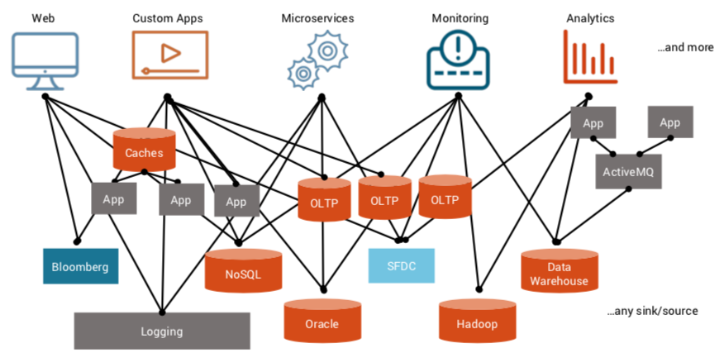
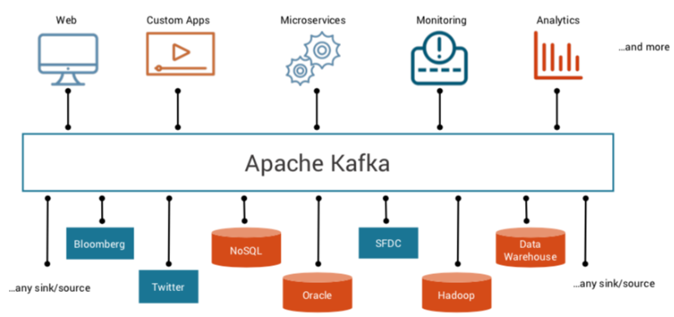
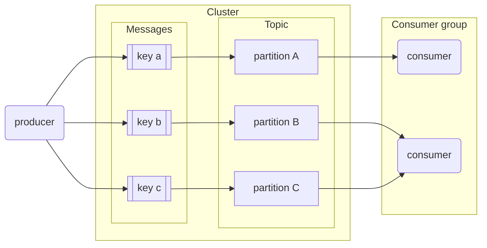

# Module 6 - Stream processing <!-- omit from toc -->

> Course video sources: videos `6.x.x` from the [DE Zoomcamp playlist](https://www.youtube.com/watch?v=hfvju3iOIP0&list=PL3MmuxUbc_hJed7dXYoJw8DoCuVHhGEQb).  
> Other resources:
> * [Slides](./slides/).
> * [Álvaro Navas notes](https://github.com/ziritrion/dataeng-zoomcamp/blob/main/notes/6_streaming.md).


## Table of contents <!-- omit from toc -->

- [Introduction to stream processing](#introduction-to-stream-processing)
- [Introduction to Kafka](#introduction-to-kafka)
  - [What is Kafka?](#what-is-kafka)
  - [Basic Kafka terms](#basic-kafka-terms)
    - [Producers and consumers](#producers-and-consumers)
    - [Message, event or record](#message-event-or-record)
    - [Topic](#topic)
    - [Logs](#logs)
    - [Broker and cluster](#broker-and-cluster)
    - [How these concepts relate to each other](#how-these-concepts-relate-to-each-other)
    - [Consumer groups](#consumer-groups)
    - [Partitioning](#partitioning)
    - [Replication](#replication)
    - [Retention](#retention)
    - [Offsets](#offsets)
- [Kafka configurations](#kafka-configurations)
  - [Topic configurations](#topic-configurations)
  - [Consumer configurations](#consumer-configurations)
  - [Producer configurations](#producer-configurations)
- [Confluent Cloud setup](#confluent-cloud-setup)
  - [Create a Confluent cluster](#create-a-confluent-cluster)
  - [Create an API key](#create-an-api-key)
  - [Create a topic and produce a sample message](#create-a-topic-and-produce-a-sample-message)
  - [Create a dummy connector](#create-a-dummy-connector)
- [Setting up Kafka and demo](#setting-up-kafka-and-demo)
  - [Installing Kafka via Docker Compose](#installing-kafka-via-docker-compose)
  - [Demo: setting up a producer and a consumer](#demo-setting-up-a-producer-and-a-consumer)
- [Avro and Schema Registry](#avro-and-schema-registry)
- [Kafka Streams](#kafka-streams)


## Introduction to stream processing

[**Data exchange**](https://www.ifaxapp.com/blog/data-exchange-networks#!#what-is-data-exchange-in-networking) refers to the process of sharing or exchanging data between two or more computer systems. When we talk about computer communication these days we generally talk about [APIs](https://en.wikipedia.org/wiki/API), which can be in the form of [REST, GraphQL, webhook, SOAP, ...](https://python.plainenglish.io/rest-webhooks-graphql-grpc-and-others-choosing-the-perfect-api-architecture-for-your-9f2e46ab6864).

[**Data streaming**](https://www.techtarget.com/searchnetworking/definition/data-streaming) is the continuous transfer of data from one or more sources at a steady, high speed for processing into specific outputs. It is usually generated simultaneously and at high speed by many data sources, which can include applications, IoT sensors, log files, and servers.


## Introduction to Kafka

### What is Kafka?

[Apache Kafka](https://kafka.apache.org/) is a distributed data streaming platform that can publish, subscribe to, store, and process streams of records in real time.

Kafka allows us to upgrade from an architecture like this:





to an architecture like this:




**Main properties** that make Kafka stand out in the streaming space:
* Highly available and fault-tolerant, with built-in mechanisms for replication and data recovery.
* Flexible.
* It's highly scalable and can handle millions of messages per second, making it suitable for large-scale data processing applications..


### Basic Kafka terms

#### Producers and consumers

In a data project we can differenciate between _producers_ and _consumers_:

* **Producers:** clients that write events to Kafka. They are those who supply data to consumers.
* **Consumers:** clients that read events from Kafka. They are those who consume the data: web pages, microservices, apps, etc.

Connecting consumers to producers directly can lead to an amorphous and hard to maintain architecture in complex projects like the one in the first image. Kafka solves this issue by becoming an intermediary that all other components connect to. It works by allowing producers to send messages which are then pushed in real time to consumers.


#### Message, event or record

A **message** is the atomic unit of data for Kafka. It's the basic communication abstraction used by producers and consumers in order to share information.

An **event** represents an immutable fact about something that happened. Examples of Events might be orders, payments, activities, or measurements. In Kafka, events are referred to as **records**. 

So, in Kafka, the terms _message_, _event_, and _record_ are synonyms.

Messages or records have the following components:
* Key: used to identify the message and other reasons, such as to determine how the data is partitioned within a stream or topic.
* Value: the actual information that producers push and consumers are interested in.
* Timestamp: used for logging.
* Optional metadata (called headers).


#### Topic

Topics are the logical categories of messages in Kafka, a continuous stream of the same type of data. A topic is an abstraction of a concept. Concepts can be anything that makes sense in the context of the project, such as "sales data", "new members", "clicks on banner", etc.

A producer pushes a message to a topic, which is then read by a consumer subscribed to that topic.


#### Logs

In Kafka we generally talk about logs, which are the way the events are stored in a topic, in an immutable manner, distributed across servers. Logs are data segments present on a storage disk. In other words, they're physical representations of data. The logs are replicated across every node in the Kafka cluster and partitioned so that consumers can subscribe accordingly and have data available to them at all times. Logs store messages in an ordered fashion. Kafka assigns a sequence ID to each message before storing it in logs.


#### Broker and cluster

A **Kafka broker** is a machine (physical or virtualized) on which Kafka is running.

A **Kafka cluster** is a group of brokers (nodes, servers) working together, talking to each other using some sort of communication protocol. Kafka used to use [ZooKeeper](https://zookeeper.apache.org/) for communication, but now it makes use of Kafka internals (the topic itself stores all the information about the topic, the partition, the replication, and is used by different nodes to basically communicate with each other).


#### How these concepts relate to each other

Here's how a producer and a consumer would talk to the same Kafka broker to send and receive messages.

* Producer sending messages to Kafka.
    ```mermaid
    flowchart LR
        p(producer)
        k{{kafka broker}}
        subgraph logs[logs for topic 'abc']
            m1[message 1]
            m2[message 2]
            m3[message 3]
        end
        p-->|1. Declare topic 'abc'|k
        p-->|2. Send messages 1,2,3|k
        k -->|3. Write messages 1,2,3|logs
        k-.->|4. ack|p
    ```
    1. The producer first declares the topic it wants to "talk about" to Kafka. In this example, the topic will be `abc`. Kafka will then assign a _physical location_ on the hard drive for that specific topic (the topic logs).
    1. The producer then sends messages to Kafka (in our example, messages 1, 2 and 3).
    1. Kafka assigns an ID to the messages and writes them to the logs.
    1. Kafka sends an acknowledgement to the producer, informing it that the messages were successfully sent and written.

* Consumer receiving messages
    * Broker and logs are the same as those in the first graph; the graph has been split in 2 for clarity.
    ```mermaid
    flowchart LR
        c(consumer)
        k{{kafka broker}}
        subgraph logs[logs for topic 'abc']
            m1[message 1]
            m2[message 2]
            m3[message 3]
        end
        c-->|1. Subscribe to topic 'abc|k
        k<-->|2. Check messages|logs
        k-->|3. Send unread messages|c
        c-.->|4. ack|k
    ```
    1. The consumer declares to Kafka that it wants to read from a particular topic. In our example, the topic is `abc`.
    1. Kafka checks the logs and figures out which messages for that topic have been read and which ones are unread.
    1. Kafka sends the unread messages to the consumer.
    1. The consumer sends an acknowledgement to Kafka, informint it that the messages were successfully received.


#### Consumer groups

A **consumer group** is composed of multiple consumers.

In regards of controlling read messages, Kafka treats all the consumers inside a consumer group as a _single entity_: when a consumer inside a group reads a message, that message will **NOT** be delivered to any other consumer in the group.

Consumer groups allow consumer apps to scale independently: a consumer app made of multiple consumer nodes will not have to deal with duplicated or redundant messages.

Consumer groups have IDs and all consumers within a group have IDs as well.

The default value for consumer groups is 1. All consumers belong to a consumer group.


#### Partitioning

**How does Kafka provide scalability?**  
Kafka’s topics are divided into several partitions. A topic is essentially a _wrapper_ around at least 1 partition. While the topic is a logical concept in Kafka, a partition is the smallest storage unit that holds a subset of records owned by a topic. Each partition is a single log file where records are written to it in an append-only fashion. Read [this medium article](https://medium.com/event-driven-utopia/understanding-kafka-topic-partitions-ae40f80552e8) for more info on partitions.

Partitions are assigned to consumers inside consumer groups:
* A partition is assigned to one consumer only.
* One consumer may have multiple partitions assigned to it.
* If a consumer dies, the partition is reassigned to another consumer.
* Ideally there should be as many partitions as consumers in the consumer group.
    * If there are more partitions than consumers, some consumers will receive messages from multiple partitions.
    * If there are more consumers than partitions, the extra consumers will be idle with nothing to do.

Partitions in Kafka, along with consumer groups, are a scalability feature. Increasing the amount of partitions allows the consumer group to increase the amount of consumers in order to read messages at a faster rate. Partitions for one topic may be stored in separate Kafka brokers in our cluster as well.

Messages are assigned to partitions inside a topic by means of their **key**: message keys are hashed and the hashes are then divided by the amount of partitions for that topic; the remainder of the division is determined to assign it to its partition. In other words: _hash modulo partition amount_.
* While it would be possible to store messages in different partitions in a round-robin way, this method would not keep track of the _message order_.
* Using keys for assigning messages to partitions has the risk of making some partitions bigger than others. For example, if the topic `client` makes use of client IDs as message keys and one client is much more active than the others, then the partition assigned to that client will grow more than the others. In practice however this is not an issue and the advantages outweight the cons.




#### Replication

**How does Kafka provide reliability?**  
Let's introduce a simple example. Imagine we have a 3 nodes cluster, and a topic is stored only in one of them, N1. So, a producer (P) is sending events to N1, and a consumer (C) is reading them from N1. If N1 goes down, the topic will not exist anymore, and there will be no communication between P and C. Here is where the concept of replication comes in. If, for example, we have a replicaton factor of 2, the topic will exist in 2 of the nodes in the cluster.

Partitions are **replicated** accross multiple brokers in the Kafka cluster as a fault tolerance precaution.

When a partition is replicated accross multiple brokers, one of the brokers becomes the **leader** for that specific partition. The leader handles the message and writes it to its partition log. The partition log is then replicated to other brokers, which contain **replicas** for that partition. Replica partitions should contain the same messages as leader partitions.

If a broker which contains a leader partition dies, another broker becomes the leader and picks up where the dead broker left off, thus guaranteeing that both producers and consumers can keep posting and reading messages. Also, if necessary, the new leader will find another node to keep the replication factor in the cluster.

We can define the _replication factor_ of partitions at topic level. A replication factor of 1 (no replicas) is undesirable, because if the leader broker dies, then the partition becomes unavailable to the whole system, which could be catastrophic in certain applications.


#### Retention

**How long the data will be retained by Kafka?**  
We have a limited amount of memory, a limited amount of nodes, so we don't save everything forever. There is a retention level that we set at the topic level. For example, if we set a retention level of 1 day, any message in this topic that is older than one day is automatically deleted


#### Offsets

The workflows from the [Basic Kafka terms section](#how-these-concepts-relate-to-each-other) work fine for a single consumer but it omits how it keeps track of read messages. It also doesn't show what would happen if 2 or more consumers are consuming messages for the same topic.

`__consumer_offsets` is a special topic that keeps track of messages read by each consumer and topic. In other words: _Kafka uses itself_ to keep track of what consumers do.

When a consumer reads messages and Kafka receives the ack, Kafka posts a message to `__consumer_offsets` with the consumer ID, the topic, the partition, and the message IDs that the consumer has read (offset). If the consumer dies and spawns again, Kafka will know the last message delivered to it in order to resume sending new ones. If multiple consumers are present, Kafka knows which consumers have read which messages, so a message that has been read by consumer #1 but not by #2 can still be sent to #2.


**`auto.offset.reset`**  
It's a configurable offset reset policy, which defines the behavior of the consumer when there is no commited position (which would be the case when the group is first initialized). You can choose either to reset the position of the ***earliest*** offset or the ***latest*** offset (the default).

In the case of latest offset, if there is a new consumer group and there are 100 commited messages, it will start to consume from 101 whenever that comes in.

If we set earliest offset when a new consumer group connects to Kafka, it will "ask" Kafka for the earliest message available to it, which is 0. So the consumer group will start consuming messages from zero offset.


## Kafka configurations

[Docs Kafka - configuration](https://kafka.apache.org/documentation/#configuration).  
[Kafka configuration reference - Confluent](https://docs.confluent.io/platform/current/installation/configuration/).

This section covers different settings and properties accross Kafka actors.


### Topic configurations

* `retention.ms`: due to storage space limitations, messages can't be kept indefinitely. This setting specifies the amount of time (in milliseconds) that a specific topic log will be available before being deleted.
* `cleanup.policy`: when the `retention.ms` time is up, we may choose to `delete` or `compact` a topic log.
    * Compaction does not happen instantly; it's a batch job that takes time.
* `partition`: number of partitions.
    * The higher the amount, the more resources Kafka requires to handle them. Remember that partitions will be replicated across brokers; if a broker dies we could easily overload the cluster.
* `replication`: replication factor; number of times a partition will be replicated.


### Consumer configurations

* `offset`: sequence of message IDs which have been read by the consumer.
* `consumer.group.id`: ID for the consumer group. All consumers belonging to the same group contain the same `consumer.group.id`.
* `auto_offset_reset`: when a consumer subscribes to a pre-existing topic for the first time, Kafka needs to figure out which messages to send to the consumer.
    * If `auto_offset_reset` is set to `earliest`, all of the existing messages in the topic log will be sent to the consumer.
    * If `auto_offset_reset` is set to `latest`, existing old messages will be ignored and only new messages will be sent to the consumer.


### Producer configurations

Message acknowledgment in Apache Kafka is crucial for ensuring the reliability of message delivery between Kafka brokers (servers) and clients (producers and consumers).

* `acks`: behaviour policy for handling acknowledgement signals. It may be set to `0`, `1` or `all`.
    * `0`: no acknowledgment, "fire and forget". The producer will not wait for the leader or replica brokers to write messages to disk.
        * Fastest policy for the producer. Useful for time-sensitive applications which are not affected by missing a couple of messages every so often, such as log messages or monitoring messages.
    * `1`: leader acknowledgment, the producer waits for the leader broker to write the messaage to disk.
        * If the message is processed by the leader broker but the broker inmediately dies and the message has not been replicated, the message is lost.
    * `all`: replica acknowledgment, the producer waits for the leader and all replica brokers to write the message to disk.
        * Safest but slowest policy. Useful for data-sensitive applications which cannot afford to lose messages, but speed will have to be taken into account.

This acknowledgment mechanism ensures that messages are reliably delivered to Kafka topics while allowing producers to choose their preferred level of reliability and durability. The choice of acknowledgment mode depends on the specific use case and trade-offs between latency and reliability requirements.


## Confluent Cloud setup

Confluent Cloud provides a 30-days free trial for new signups: [link](https://www.confluent.io/confluent-cloud/tryfree/).

This will alow us to have a Kafka cluster in the cloud, as an alternative to setting it up locally via Docker.


### Create a Confluent cluster

The first time we log in we need to create a cluster (basic type). We choose Google Cloud, a region (Madrid / _europe-southwest1_ in my case), and single-zone availability. In the next step we click on _Skip payment_. Finally, we choose a name (e.g., _zoomcamp_kafka_cluster_) and launch our cluster.

Once it's created, a cluster dashboard with different options will be available for us.


### Create an API key

Once in the cluster console, go to `API Keys` > `Create key`:
* Access control: global access.
* Description: zoomcamp_kafka_cluster_api_key.
* Download and continue.


### Create a topic and produce a sample message

Go to `Topics` > `Create topic`:
* Topic name: tutorial_topic.
* Partitions: 2.
* Storage retention time: 1 day.
* Save and create.

We can new create a sample message from the topic board: `Produce new message` > `Produce`.


### Create a dummy connector

Go to `Connectors` > `Datagen Source`:
* Check out topic.
* Global access.
* Configuration:
    + Output record value format: JSON.
    + Template: Orders.
* Connector name: tutorial_orders_connector.


Once the connector is running, it will start to consume messages from the topic. In order not to run out of the initial 400$ free credit, we pause the connector.


## Setting up Kafka and demo

### Installing Kafka via Docker Compose

Install instructions for Kafka can be found in [the official website](https://kafka.apache.org/quickstart).

Due to the complexity of managing a manual Kafka install, a docker-compose script is provided [in this link](./docker-compose.yml). The Docker images are provided by [Confluent](https://www.confluent.io/), a Kafka tool vendor. The script defines the following services:

* **[`zookeeper`](https://zookeeper.apache.org/)**: a centralized service for maintaining configuration info. Kafka uses it for maintaining metadata knowledge such as topic partitions, etc.
    * Zookeeper is being phased out as a dependency, but for easier deployment we will use it in the lesson.
* **`broker`**: the main service. A plethora of environment variables are provided for easier configuration.
    * The image for this service packages both Kafka and [Confluent Server](https://docs.confluent.io/platform/current/installation/migrate-confluent-server.html), a set of commercial components for Kafka.
* **`kafka-tools`**: a set of additional Kafka tools provided by [Confluent Community](https://www.confluent.io/community/). We will make use of this service later in the lesson.
* **`schema-registry`**: provides a serving layer for metadata. We will make use of this service later in the lesson. 
* **`control-center`**: a web-based Kafka GUI.
    * Kafka can be entirely used with command-line tools, but the GUI helps us visualize things.

Start the deployment from the script with `docker compose up -d` . It may take several minutes to deploy on the first run. Check the status of the deployment with `docker ps` . Once the deployment is complete, access the control center GUI by browsing to `localhost:9021` .


### Demo: setting up a producer and a consumer

We will now create a demo of a Kafka system with a producer and a consumer and see how messages are created and consumed.

1. Prerequisites: Python packages needed for this module, listed in [environment.yml](../environment.yml): `kafka-python`, `confluent-kafka`, `requests`, `avro`, `fastavro`, `faust`.
2. In the Control Center GUI, select the `Cluster 1` cluster and in the topic section, create a new `demo_1` topic with 2 partitions and default settings.
3. Run the `producer.py` script.
    * This script registers to Kafka as a producer and sends a message each second until it sends 1000 messages.
    * With the script running, you should be able to see the messages in the Messages tab of the `demo_1` topic window in Control Center.
4. In a new terminal, run the `consumer.py` script.
    * Before running it, make sure the first argument of `consumer = KafkaConsumer()` is `"demo_1"`, and the `group_id` is `"consumer.group.id.demo.1"`.
    * This script registers to Kafka as a consumer and continuously reads messages from the topic, one message each second.
    * You should see the consumer read the messages in sequential order. 
5. Kill the consumer and run it again to see how it resumes from the last read message.
6. With the `consumer.py` running, modify the script and change `group_id` to `"consumer.group.id.demo.2"`. Run the script on a separate terminal; you should now see how it consumes all messages starting from the beginning because `auto_offset_reset` is set to `earliest` and we now have 2 separate consumer groups accessing the same topic.
7. On yet another terminal, run the `consumer.py` script again. The consumer group `"consumer.group.id.demo.2"` should now have 2 consumers. If you check the terminals, you should now see how each consumer receives separate messages because the second consumer has been assigned a partition, so each consumer receives the messages for their partitions only.
8.  Finally, run a 3rd consumer. You should see no activity for one of the three consumers because the topic only has 2 partitions, so no partitions can be assigned to the idle consumer.


## Avro and Schema Registry


## Kafka Streams

[Kafka Streams concepts](https://docs.confluent.io/platform/current/streams/concepts.html).

---

TO DO

---
